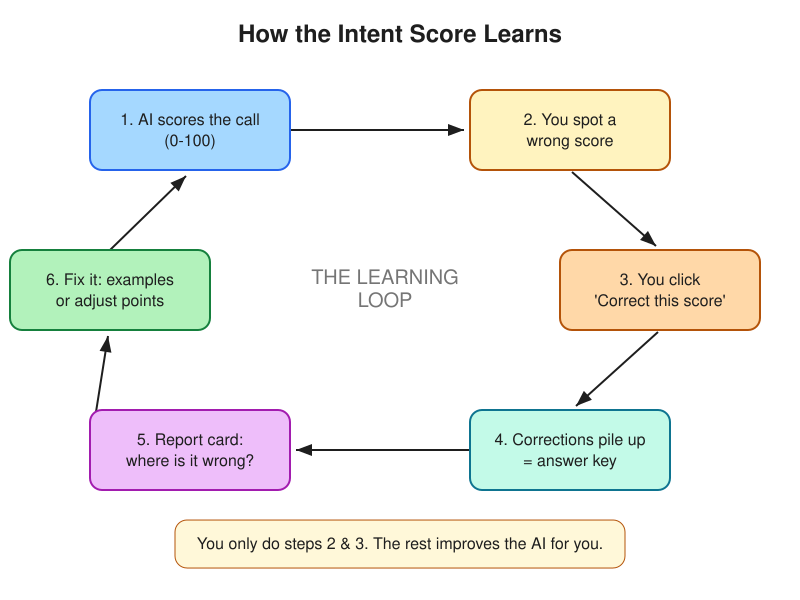

# How the AI Intent Score Works — and How It Learns

A plain-English guide. No code knowledge needed.

---

## 1. What the intent score is

After every AI sales call, the lead gets a number from **0 to 100** — the
**intent score**. Higher = more likely to buy. It also gets a label:
**Qualified / Warm / Cold / Disqualified**.

The problem we fixed: sometimes the score is plain wrong. A 39-second call with
two garbled lines was scored **65** — far too high. Worse, there was no way to
tell the system it was wrong, so it kept making the same mistake.

This guide explains the new system that lets you **correct wrong scores** and
**teaches the AI to do better over time.**

---

## 2. How the score is calculated (the two steps)

The score is NOT one big guess by the AI. It's built in two clean steps:

**Step A — The AI reads the call.**
It listens to the transcript and fills in a scorecard of "signals":
*Did the dealer show Need? Budget? Curiosity? Engagement?* — each rated
unknown / weak / moderate / strong.

**Step B — Simple math turns the scorecard into a number.**
Each signal has a fixed point value (Need = 30 pts, Budget = 25, etc.). The
points are added up. This step is pure arithmetic — no guessing.

Why this matters: it means a wrong score has only **two possible causes**, and
each has its own fix:

| What went wrong | Example | The fix |
|---|---|---|
| **The AI misread the call** | "Saw curiosity" in a call that had none | Teach it with examples (Lever A) |
| **The recipe is off** | Read it right, but curiosity shouldn't be worth so much | Adjust the points (Lever B) |

---

## 3. The learning loop (the big picture)

The key idea: **your corrections are the fuel.** The more calls you correct, the
smarter the system gets. Nothing learns until you start correcting.

---

## 4. What YOU do (the simple part)

### One-time setup
Create the new database table once: apply the file
`drizzle/E-159_intent_score_feedback.sql` to the **AWS database**. (Do this once;
re-running it is harmless.)

### Your everyday habit: correct wrong scores
1. Open a call → **Overview** tab.
2. See the yellow box **"Score looks wrong?"** → click **Correct this score**.
3. Pick what it *should* be (Qualified / Warm / Cold / Disqualified).
4. Optionally type a note ("only 2 garbled lines, no real interest").
5. Optionally click **Refine signals** to fix individual ratings
   (e.g. set Curiosity from "strong" to "none").
6. **Save.**

That's the whole job. Each save teaches the system one real example.

Aim for **at least 20–30 corrections** before expecting the learning steps to be
meaningful. With only a handful, the system would "learn" from noise.

---

## 5. The behind-the-scenes tools (run occasionally)

These are terminal commands. They **measure and improve** — you only need them
once you've collected corrections.

| Command | Plain meaning |
|---|---|
| `npm run intent:export-golden` | Gather all your corrections into one "answer key" file. **Reads from BOTH sandbox and production by default** and merges them (if the same call was corrected in both, the most recent correction wins). |
| `npm run eval:intent` | The **report card**: how often did the AI agree with you, and which signal does it get wrong most? Shows an overall score **plus a sandbox-vs-production breakdown**. Saves a webpage at `docs/ai intent/eval/report.html`. |
| `npm run intent:tune-weights` | The **recipe adjuster**: suggests new point values that would match your corrections better. It only *suggests* — a human decides whether to apply. |

**Pointing at one environment:**

| Command | What it does |
|---|---|
| `npm run intent:export-golden` | Both DBs, merged (default) |
| `npm run intent:export-golden -- --db=prod` | Production only |
| `npm run intent:export-golden -- --db=sandbox` | Sandbox only |
| `npm run intent:tune-weights -- --source=prod` | Tune the recipe on production corrections only |

> **One-time setup applies to BOTH databases.** The `drizzle/E-159_intent_score_feedback.sql`
> table must be created on **both** sandbox and production. If it's missing on one,
> `export-golden` prints a clear warning naming that environment and still reads the other.
> Reading production is **read-only** — these commands never write to it.

You can ignore `tune-weights` until the report card shows the AI keeps disagreeing
*even when it read the call correctly* — that's the only time the recipe itself
needs changing.

---

## 6. What was already fixed

The specific "65" bug is **already patched**. We gave the AI a clear rule
("a one-word 'yes' or a brand name is not real interest") and showed it that exact
Rahul call as a training example. So short/garbled calls should score low now,
even before you correct anything.

Everything else in this guide is about keeping the system improving over time as
your team corrects more calls.

---

## 7. One-paragraph summary

The AI reads each call into a scorecard, then simple math turns that into a 0–100
score. When the score is wrong, you click **"Correct this score"** and tell it the
right answer. Those corrections become an answer key. A report card
(`npm run eval:intent`) then shows how well the AI is doing and pinpoints its
mistakes, which we fix either by teaching it better (examples) or adjusting the
scoring recipe (points). The loop repeats, and the score keeps getting more
accurate — powered entirely by your corrections.
