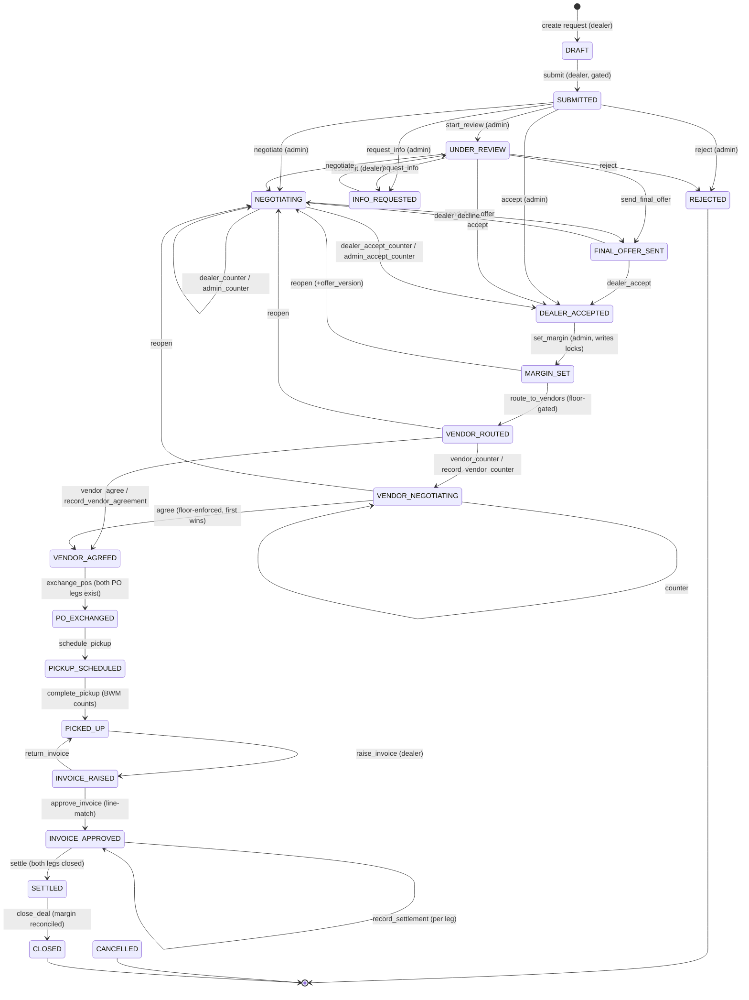

# Part I — Business & Product

## 1. What it is

iTarang runs a marketplace for **used / end-of-life EV batteries**. It sits between two parties who would otherwise never transact safely:

- **Battery dealers** who have accumulated used or dead battery packs and want to sell them.
- **Scrap vendors / recyclers** who buy those packs in bulk.

iTarang is not a passive listing board — it acts as the **principal in the middle** ("back-to-back trade"). It buys the batteries from the dealer at one price and sells them to a vendor at a higher price. Neither side ever sees the other's identity or the price iTarang charges the other party.

## 2. How it makes money — the margin model

```
Dealer sells at ₹X  ──▶  iTarang  ──▶  Vendor buys at ₹Y      (Y > X)

                iTarang's margin = Y − X  (per battery, summed across the lot)
```

1. A dealer submits a lot of batteries with photos and asking prices.
2. iTarang's desk negotiates the **dealer buy-price** and **locks** it.
3. The desk adds a **margin** (a flat ₹ amount or a %) on top of each line — this becomes the floor price it will accept from a vendor.
4. The lot is offered (with the dealer's identity hidden) to several vendors; the first vendor to agree at or above the floor wins.
5. iTarang pays the dealer, collects from the vendor, and keeps the difference.

The **realised margin** = Σ quantity × (vendor price − dealer price). It is computed by the system from locked prices, never typed in by a person, and is **reconciled against the money ledger** when a deal closes — so the reported "margin earned" provably equals the money that actually moved.

## 3. Who uses it

| Party | Who | What they do |
|-------|-----|--------------|
| **Dealer** | Battery dealers (dealer portal login) | Create buyback requests, upload evidence, negotiate, get paid |
| **Admin / Ops** | iTarang staff — roles: `admin`, `ceo`, `business_head`, `sales_head` | Review, negotiate, set margin, route to vendors, arrange pickup, approve invoices, settle payments, close deals |
| **Scrap Vendor** | Recyclers / bulk buyers (vendor portal login) | Receive masked offers, quote/agree, raise POs, pay iTarang |

## 4. What it does, at a glance

The life of one deal:

```
Dealer creates request → uploads ≥5 photos/line + provenance → SUBMITS
      → Admin reviews (accept / reject / negotiate / ask for info)
      → Price agreed & LOCKED → Admin sets margin
      → Lot routed to N vendors (dealer identity hidden)
      → A vendor agrees at/above floor
      → POs exchanged → pickup scheduled → batteries collected
      → Invoice raised & approved (line-by-line) → money settled both sides
      → Deal CLOSED (margin reconciled)
```

**Feature highlights per party:**

- **Dealer:** multi-line requests, photo upload, provenance capture, two-way price negotiation, accept/decline offers, acknowledge collected-vs-declared count differences, raise their own GST invoice, download purchase orders, track pickups & payments, in-app notifications.
- **Admin:** review queue & dashboard KPIs, itemized negotiation, margin setting, vendor onboarding & routing, pickup scheduling with statutory compliance capture, invoice approval, manual **and** online (bank-gateway) settlement, bank-statement reconciliation, money ledger, reports, price-book management, e-signed agreements.
- **Vendor:** masked quotations (no dealer identity), quote/counter/agree, raise their PO, pay by online payment link or bank transfer, track orders & payments.

## 5. Trust & safeguards (why the numbers can be believed)

These are built into the system's structure, not left to staff discipline:

- **Money is server-computed, never client-stated.** No screen lets a dealer, vendor, or even an admin *type* a settlement amount — every figure is derived from the locked prices. A tampered request body cannot change what gets paid.
- **Dealer ↔ vendor secrecy is structural.** A dealer never sees the margin or the vendor; a vendor never sees the dealer's identity or the margin. This is enforced by redaction in the data layer **and** by automated tests that fail the build if a dealer-facing screen so much as references a secret field.
- **Photo fraud detection.** Every battery photo gets a *perceptual hash* (a fingerprint that survives re-compression and resizing). If the **same battery photo appears across two different dealers**, it may mean one battery is being sold twice — the system flags it and alerts admins.
- **Count-variance payout gate.** If the number of batteries collected at pickup differs from what the dealer declared, the dealer's payment is **blocked** until they acknowledge the difference.
- **Regulatory compliance.** Pickups capture e-way bills and weighbridge slips (Battery Waste Management Rules, 2022). Previous-owner identity stores **only the last 4 digits** of Aadhaar (full Aadhaar is legally unstorable under DPDP/UIDAI); PAN and payee bank details are captured where a payment must go to a person other than the dealer.
- **Immutable audit trail.** Every state change writes an audit row in the same database transaction, and the audit table physically **cannot be edited or deleted** (a database trigger blocks it).
- **Exact invoice matching.** An invoice is approved only if **every line** matches the locked price — a single edited line blocks approval even if the grand total happens to match.

## 6. Cost & scale

- **Battery photos and PDFs live in cloud object storage (AWS S3), not the database.** The database stores only tiny text pointers to them.
- **Database footprint is small:** roughly **60–120 KB of Postgres per completed deal** (order-of-magnitude). At **100,000 completed deals that is ≈ 6–12 GB** of database — trivial. The associated images in S3 are the real bulk (tens of MB per deal → terabytes at scale), but S3 is cheap and scales independently.
- The heaviest-growing database tables are the audit log and the notification log (both append-only), not the images.

## 7. Current status (as of this writing)

- **Live on the shared development/sandbox database** (`db-1`, which the sandbox app also uses). ~35 tables, all state machinery, triggers, and safeguards verified present.
- **Not yet deployed to production** — every buyback migration is written to safely **no-op** on production until the tables are created there.
- The fast leading-wildcard search needs the Postgres `pg_trgm` extension enabled per database.

---

# Part II — Technical Reference

## 1. Architecture & design principles

The whole module is organized around a handful of load-bearing invariants, most enforced *by construction* (schema / types / triggers), not by convention:

1. **One state machine, one write choke-point.** `src/lib/buyback/state-machine.ts` is a pure, exhaustively-tested transition table (state × action × role). Every mutating route goes through `applyTransition()` (`src/lib/buyback/transition.ts`), which — in a single DB transaction — locks the deal row, validates the transition, writes the new status, writes an audit row, and enqueues notification event(s). Illegal transitions are rejected **server-side** (HTTP 409); the UI's button-ghosting is cosmetic.
2. **Money is always derived from `deal_line_locks`.** Clients never state amounts. `src/lib/buyback/money.ts` recomputes payouts, receipts, and margins from the immutable per-SKU locks on every read and every settlement.
3. **No lump sums anywhere.** `negotiation_rounds`, `vendor_threads`, `invoices`, and `purchase_orders` have **no amount column** — every price is itemized per line in a child table, so a disguised lump sum is unrepresentable.
4. **Dealer/vendor mutual redaction.** Serializers (`serialize.ts`) produce dealer-safe and vendor-safe payloads where secret fields are *structurally absent*, backed by contract tests.
5. **Background work runs as in-process tickers.** There is no live BullMQ worker or Vercel cron in production on the PM2 VPS, so all periodic jobs are `setInterval` tickers registered in `src/instrumentation-node.ts` (dispatch, dedup, price-review nudge, agreement sync, gateway poller).

Foundational files: `src/lib/buyback/state-machine.ts`, `transition.ts`, `flow.ts`, `roles.ts`, `auth.ts`; schema in `src/lib/db/schema.ts` (~L7478–8750).

## 2. Roles & access

- **Admin roles:** `BUYBACK_ADMIN_ROLES = ["admin", "ceo", "business_head", "sales_head"]` (`roles.ts`). Kept dependency-free so the Edge-runtime `src/middleware.ts` can import it to gate `/admin/buyback`.
- **Dealer scoping:** `loadOwnRequest` — a dealer requesting another dealer's request gets **404, not 403** (403 would confirm the request exists).
- **Vendor scoping:** `loadOwnThread` — a vendor can only touch their own thread.
- **Portal role resolution:** `portalRoleOf(role, hasDealer, hasVendor)` decides dealer vs admin vs vendor view. Vendor logins are keyed by `users.vendor_entity_id` (migration E‑195).

## 3. Request lifecycle — the 21-state machine

The `buyback_deal_status` enum has **21 states** (one `buyback_deals` row per `buyback_requests` row, created at `DRAFT`). `offer_version` bumps on every reopen so v2 offers/locks supersede v1.



**Full transition table** (from → action → to → actor):

| From | Action (route) | To | Actor |
|---|---|---|---|
| — | create request | **DRAFT** | dealer |
| DRAFT | `submit` (gate: ≥1 line, ≥5 photos/line, provenance, specs) | SUBMITTED | dealer |
| SUBMITTED | `start_review` | UNDER_REVIEW | admin |
| SUBMITTED / UNDER_REVIEW | `accept` | DEALER_ACCEPTED | admin |
| SUBMITTED / UNDER_REVIEW | `reject` (terminal) | REJECTED | admin |
| SUBMITTED / UNDER_REVIEW | `negotiate` | NEGOTIATING | admin |
| SUBMITTED / UNDER_REVIEW | `request_info` (unit-targeted) | INFO_REQUESTED | admin |
| INFO_REQUESTED | `resubmit` | UNDER_REVIEW | dealer |
| UNDER_REVIEW / NEGOTIATING | `send_final_offer` | FINAL_OFFER_SENT | admin |
| NEGOTIATING | `dealer_counter` / `admin_counter` (self-loop) | NEGOTIATING | dealer / admin |
| NEGOTIATING | `dealer_accept_counter` / `admin_accept_counter` | DEALER_ACCEPTED | dealer / admin |
| FINAL_OFFER_SENT | `dealer_accept` | DEALER_ACCEPTED | dealer |
| FINAL_OFFER_SENT | `dealer_decline` | NEGOTIATING | dealer |
| DEALER_ACCEPTED | `set_margin` (writes `deal_line_locks`, floor) | MARGIN_SET | admin |
| DEALER_ACCEPTED / MARGIN_SET / VENDOR_ROUTED / VENDOR_NEGOTIATING | `reopen` (+offer_version, open threads → LOST) | NEGOTIATING | admin |
| MARGIN_SET | `route_to_vendors` (floor-gated; N masked quotations) | VENDOR_ROUTED | admin |
| VENDOR_ROUTED / VENDOR_NEGOTIATING | `record_vendor_counter` / `vendor_counter` | VENDOR_NEGOTIATING | admin (hearsay) / vendor |
| VENDOR_ROUTED / VENDOR_NEGOTIATING | `record_vendor_agreement` / `vendor_agree` (floor-enforced; first wins) | VENDOR_AGREED | admin / vendor |
| VENDOR_AGREED | `exchange_pos` (both PO legs present) | PO_EXCHANGED | admin / vendor |
| PO_EXCHANGED | `schedule_pickup` | PICKUP_SCHEDULED | admin |
| PICKUP_SCHEDULED | `complete_pickup` (BWM counts; may raise variance gate) | PICKED_UP | admin |
| PICKED_UP | `raise_invoice` | INVOICE_RAISED | dealer |
| INVOICE_RAISED | `approve_invoice` (line match; also raises iTarang→vendor invoice) | INVOICE_APPROVED | admin |
| INVOICE_RAISED | `return_invoice` (with reason) | PICKED_UP | admin |
| INVOICE_APPROVED | `record_settlement` (self-loop, per leg) | INVOICE_APPROVED | admin |
| INVOICE_APPROVED | `settle` (both legs closed) | SETTLED | admin |
| SETTLED | `close_deal` (margin reconciliation gate) | CLOSED | admin |
| most non-physical states | `cancel` | CANCELLED | dealer / admin |

Notes:

- **Terminal states:** `REJECTED`, `CANCELLED`, `CLOSED`.
- **`cancel`** is available from most non-physical states but **not** after `PICKED_UP` (the batteries are physically iTarang's — undoing that is a returns problem v1 doesn't model).
- **`DEALER_REOPENED`** exists in the enum but is intentionally **unreachable** — `reopen` routes to `NEGOTIATING` with an `offer_version` bump instead.
- **Reopen boundary (M07):** `reopen` is legal only **before** `VENDOR_AGREED`. Once a vendor agrees, the margin is a commitment to a third party, so there is no reopen edge onward (409 server-side).

## 4. Dealer features

Dealer UI: `src/app/(dashboard)/dealer-portal/buyback/` (`page`, `new`, `[id]`, `requests`, `pickups`, `payments`, `notifications`). Every dealer API is entity-scoped via `loadOwnRequest`.

| Capability | Route |
|---|---|
| Create a request (DRAFT) | `POST /api/buyback/requests` |
| Add / edit / delete SKU lines (auto-generates Unit 1..N; price snapshotted from catalog) | `POST /api/buyback/requests/[id]/lines`, `.../lines/[lineId]` |
| Edit line spec & asking price (brand, chemistry, V/Ah, weight, IOT y/n) | via `line-spec.ts` on the line routes |
| Choose pickup address; manage saved addresses | `PATCH /api/buyback/requests/[id]`, `/api/buyback/pickup-addresses` |
| Upload line photos (≥5/line) | `POST /api/buyback/photos/presign` then `POST /api/buyback/requests/[id]/photos` (also `/api/buyback/uploads`, `/api/buyback/media`) |
| Enter provenance (prev-owner docs or own-stock; payee bank details) | `POST /api/buyback/requests/[id]/provenance` |
| Submit (server-side gate) | `POST /api/buyback/requests/[id]/submit` |
| Resubmit after an info request | `POST /api/buyback/requests/[id]/resubmit` |
| Save / edit draft | `/api/buyback/requests/[id]/draft` |
| Counter-offer (itemized per SKU) | `POST /api/buyback/requests/[id]/counter` |
| Accept iTarang's standing counter directly | `POST /api/buyback/requests/[id]/accept-counter` |
| Accept / decline a final offer (one binary answer for the set) | `POST /api/buyback/final-offers/[id]/respond` |
| Acknowledge a count variance (lifts payout block) | `POST /api/buyback/requests/[id]/variance-ack` |
| Raise own invoice (own GST series; prices prefilled from locks) | `POST /api/buyback/requests/[id]/invoice` |
| Download PO PDF (iTarang→dealer) | `GET /api/buyback/requests/[id]/po` |
| View deal detail (redacted; margin/vendor absent) | `GET /api/buyback/requests/[id]` |
| View pickups / payments (own leg only) | pages `pickups`, `payments` |
| Search own requests | `/api/buyback/search` |
| Notifications bell + summary | `/api/buyback/notifications`, `/api/buyback/notifications/summary` |
| Browse catalog variants | `/api/buyback/catalog/variants` |

**Submit gate** (`src/lib/buyback/submit-gate.ts`): ≥1 line, **≥5 photos per line** (`MIN_PHOTOS_PER_LINE = 5`), provenance present, required spec fields present, functional/non-functional split ≤ quantity (a ceiling, not equality). IOT brand is **not** required (blank resolves to "Intellicar"), but the IOT yes/no is.

## 5. Admin features

Admin UI: `src/app/(dashboard)/admin/buyback/` (`page` queue, `dashboard`, `[id]`, `catalog`, `vendors`, `negotiations`, `payments`, `statements`, `ledger`, `documents`, `notifications`). Gated to `BUYBACK_ADMIN_ROLES`.

**Review & dealer negotiation**
- Review queue / dashboard KPIs — `/api/admin/buyback/queue`, `/api/admin/buyback/dashboard`
- Four review decisions (`accept` / `reject` / `negotiate` / `request_info`) — `POST /api/admin/buyback/requests/[id]/decision`
- Counter-offer (itemized) — `POST /api/admin/buyback/requests/[id]/counter`
- Accept dealer's standing counter — `.../accept-counter`
- Send itemized, versioned final offer — `.../final-offer`
- Set per-line margin (FLAT ₹ or %) → writes immutable `deal_line_locks` + `floor_total` — `.../margin`
- Reopen (before vendor agreement) — `.../reopen`
- View request (full, unredacted) — `.../requests/[id]`

**Vendor leg**
- Vendor board (threads, routable vendors, POs, pickup) — `GET .../requests/[id]/vendor-board`
- Route lot to N vendors (masked quotation PDFs, opens threads, emails) — `.../requests/[id]/routing`
- Record a vendor's counter/agree (hearsay) — `POST /api/admin/buyback/threads/[id]/record`
- Onboard / list vendors — `/api/admin/buyback/vendors`; activate/suspend — `.../vendors/[entityId]/activate`
- Vendor onboarding documents (E-222) — `POST .../vendors/uploads` returns a `document_id`, which `POST .../vendors` then claims. Keys stay server-derived: the browser never handles one
- Re-send a vendor's generated password after a bounced email (E-222) — `POST .../vendors/[entityId]/credentials`. Onboarding lands the role `PENDING` and only flips it `ACTIVE` when that email is delivered, so this is the recovery path, not a vetting decision (that is `/activate`)

**Fulfilment**
- Issue dealer PO / record vendor PO — `.../requests/[id]/po/[leg]`
- Raise proforma invoice against vendor PO — `.../requests/[id]/proforma`
- Schedule pickup — `.../requests/[id]/pickup`
- Complete pickup (e-way bill / weighbridge; computes variance) — `.../requests/[id]/pickup/complete`

**Money**
- Review & approve/return invoice (line-by-line vs locks) — `.../requests/[id]/invoice`
- Record manual settlement (server-derived amount; proof mandatory) — `.../requests/[id]/settlements`
- Pay dealer via RazorpayX payout — `.../settlements/payout`; collect vendor via Razorpay Payment Link — `.../settlements/payment-link` (+ `/cancel`, `/gateway/[txnId]/refresh`)
- View bank details / margin — `.../requests/[id]/bank-details`, `.../margin`
- Close deal (reconciliation gate) — `.../requests/[id]/close`

**Statements / ledger / reports / documents / catalog / agreements**
- Import bank statements + match rows into settlements — `/api/admin/buyback/statements`, `.../statements/[id]/rows`, `.../statements/rows/[rowId]/confirm`
- Money ledger (IN/OUT/net + reconciliation; CSV) — `/api/admin/buyback/ledger`
- Reports (margin / funnel / aging / dealer / vendor; CSV) — `/api/admin/buyback/reports`
- Documents centre — `.../documents/recent`, `.../documents/dealers`, `.../documents/dealers/[entityId]`
- Catalog / price-book (list/edit variants, record review) — `/api/admin/buyback/catalog`, `.../catalog/[id]`, `.../catalog/review`
- Agreements (Digio eSign send + status sync) — `/api/admin/buyback/agreements`
- Admin search (leading-wildcard, trigram) — `/api/admin/buyback/search`

## 6. Negotiation model (symmetric, itemized, 2-sided)

The dealer↔iTarang negotiation is fully symmetric and always priced per SKU.

- **Tables:** `negotiation_rounds` (leg = DEALER, **no amount column**) + `negotiation_round_lines` (per-SKU price); `final_offers` + `final_offer_lines` for the formal offer.
- **Open:** admin `negotiate` inserts round 1 → NEGOTIATING.
- **Counters (self-loop):** either side counters repeatedly (`dealer_counter`, `admin_counter`); each appends a round; **every counter must price every line** (a partial counter is a disguised lump sum). The round number is the notification discriminator so repeat counters aren't swallowed.
- **Direct accept:** either party can accept the other's standing counter (`dealer_accept_counter` / `admin_accept_counter`), both → DEALER_ACCEPTED. Implemented once in `dealer-accept.ts` (`acceptStandingCounter`), which snapshots the standing round into an ACCEPTED `final_offer` so downstream reads it identically to a formal acceptance.
- **Formal final offer:** admin `send_final_offer` writes a versioned `final_offer` → FINAL_OFFER_SENT; dealer gives **one binary accept/decline for the whole set** (`/api/buyback/final-offers/[id]/respond`).
- **Provisional:** dealer acceptance is provisional — an admin may `reopen` (bumping `offer_version`) any time before vendor agreement.

## 7. Vendor leg

A vendor = an `accounts` row + a `business_entity_roles` row (`role = SCRAP_VENDOR`) + a `scrap_vendors` row + a login keyed by `users.vendor_entity_id`. Only vendors whose role is `ACTIVE` are routable. There is a self-serve **vendor portal** (`src/app/(dashboard)/vendor-portal/`) and a vendor API namespace (`src/app/api/vendor/`).

- **Routing (fan-out):** admin `route_to_vendors` renders one **masked** quotation PDF per vendor (no dealer name/phone/GST/dealer_price), opens a `vendor_threads` row per vendor with itemized `vendor_thread_lines` (`ask_price`), and emails each (battery photos attached). Floor-gated (M08).
- **Vendor response — two entry paths, one implementation** (`vendor-response.ts` → `applyVendorResponse`):
  - Admin transcribes an emailed reply — `POST /api/admin/buyback/threads/[id]/record` (`record_vendor_*`, hearsay).
  - Vendor answers first-hand — `POST /api/vendor/threads/[id]/respond` (`vendor_*`, testimony).
  - `counter` → VENDOR_NEGOTIATING; `agree` → VENDOR_AGREED; `reject`/walk-away sets the thread `LOST` and moves **no deal status** (deal still live with other vendors — there is deliberately no `vendor_reject` action).
- **Floor enforcement (M10):** a below-floor agreement is refused (422, no override). Floor = dealer_price + margin.
- **First AGREED wins, atomically:** partial unique index `vendor_threads_one_agreed_per_deal` allows ≤1 AGREED thread per deal; the winner auto-sets all other threads `LOST` in the same transaction (each gets a courteous close that never carries the winning price) and fills `vendor_price` into `deal_line_locks` (the one write the fill-once trigger permits).
- **POs (M11):** the vendor is the buyer and raises their PO — recorded by admin (`.../po/vendor`) or first-hand by the vendor (`POST /api/vendor/threads/[id]/po`), both via `recordVendorPo` in `po.ts`. Both PO legs present → `exchange_pos` → PO_EXCHANGED.
- **Proforma & payment:** iTarang raises a proforma (`PI-{n}-V`) against the vendor PO; on invoice approval iTarang raises its own tax invoice (`INV-{n}-V`); vendor pays via Payment Link (`/api/vendor/payment-links`) or bank transfer (recorded as the VENDOR / IN settlement leg). Vendor self-registration: `POST /api/vendor/register`.

## 8. Core library functions (`src/lib/buyback/`)

Grouped by concern (one line each):

**Money / ledger reads — `money.ts`**
- `dealMoney(dealId)` — one row per SKU from the current lock generation (`bd.offer_version = dll.offer_version`); the single source everything derives from.
- `dealerPayout` (Σ qty×dealer_price, OUT), `vendorReceipt` (Σ qty×vendor_price, IN), `plannedMargin`, `realisedMargin` (Σ qty×(vendor−dealer) — the M14 reconciliation figure).
- `groupTxnId` / `legSubId` — `BB-1024 → TXN-1024` with `-D`/`-V` leg sub-ids (`leg_sub_id` is uniquely indexed — the last defence against double-paying a leg).
- `dealerPayoutSourcesForEntity` — batched, **dealer-safe** payout summary (never selects vendor_price/margin).

**Pickup / variance / BWM — `pickup.ts` + `variance.ts`**
- `computeVariance(expected, actual)` — pure, **per-line** delta of declared vs collected counts.
- `assertPayoutAllowed(dealId, leg)` — refuses a **DEALER** settlement while a count variance is unacknowledged (M05 gate).
- `dealerPickupSourcesForEntity` — dealer-safe pickup summary (omits BWM S3 keys).

**Roles / auth — `roles.ts`, `auth.ts`** — `BUYBACK_ADMIN_ROLES`, `requireDealer`, `requireBuybackAdmin`, `loadOwnRequest`/`loadAnyRequest`, `portalRoleOf`.

**Photo dedup — `phash.ts` + `dedup.ts`**
- `computePhash(buffer)` — dHash (64-bit fingerprint via `sharp`), survives re-compression/resize/brightness; `hammingDistance`, `isDuplicate(a,b,threshold=6)`.
- `runDedupSweep()` — computes missing hashes then flags near-duplicates against the *earliest* photo; sets `dup_flag = DUPLICATE_SAME_DEALER | DUPLICATE_CROSS_DEALER`; **only cross-dealer escalates** to admins (possible double-sale / fraud).

**Invoice matching — `invoice-match.ts`**
- `matchInvoiceToLocks(invoiceLines, locks)` — pure, exact (NUMERIC(12,2), zero tolerance); per-line verdicts (`PRICE_MISMATCH`, `QUANTITY_MISMATCH`, `LINE_NOT_ON_DEAL`, `LINE_MISSING`); one wrong line blocks approval even when the total matches.

**Statement reconciliation — `statement.ts`**
- `parseStatement(buffer, filename)` — liberal CSV/XLSX parser → normalized signed rows (Indian date/amount formats).
- `suggestMatches(rows)` — raises `SUGGESTED` links against open expectations (from the *same* `dealMoney` functions) only when exactly one expectation matches to the paisa with the correct sign; **never auto-applies**.

**Catalog / price book — `catalog.ts`** — `listVariants`, `repriceVariant` (bumps `price_book_version`, appends `catalog_price_history`; open lines untouched because the price is snapshotted onto the line at creation — M16), `checkPriceReviewDue()` (weekly nudge).

**Agreements — `agreement.ts`** — `renderAgreementHtml` (non-circumvention clause), `sendAgreement` (renders PDF → S3 → Digio eSign → `agreements` row + PENDING `business_entity_roles`), `syncAgreements()` (polls Digio; on signature flips the role to ACTIVE — the routing unlock).

**Transitions — `tx.ts`, `transition.ts`, `state-machine.ts`** — `applyTransition` (single writer of deal status), `loadDealForUpdate` (row lock), `recordActivity` (audit); `state-machine.ts` the pure legal-transition table; `flow.ts` maps status → progress step.

**Storage / upload — `storage.ts`, `upload.ts`** — server-derived S3 key builders (`quotationKey`, `poKey`, `statementKey`, `evidenceKeyFor`, `uploadKeyFor`), `ALLOWED_UPLOAD_TYPES` (a photo must be an image so it can be hashed), `requireOwnLine`, `assertS3Configured`.

**Misc** — `request-no.ts` (`nextRequestNo` from a Postgres sequence), `errors.ts` (typed `HttpError`/`TransitionError`/`ForbiddenError`/`NotFoundError`/`ValidationError`), `format.ts` (`formatBatteryLine`, `inr`), `line-spec.ts` (zod line validation + PATCH semantics), `pdf/po-template.ts` (+ `quotation-template.ts`, `vendor-invoice-template.ts` — templates carry **no** margin/vendor field), `dispatch.ts` + `notification-meta.ts` (see §11), `gateway.ts` (see §12), `serialize.ts` (redaction), `parties.ts` (`loadDealerBank`, `isValidIfsc`).

## 9. Money & settlement mechanics

1. **Estimate / price book** — a line copies `expected_price_per_unit` + `price_book_version_at_create` from `catalog_variants`. Catalog reprices never touch open lines.
2. **Offer → lock** — at `set_margin`, prices freeze into `deal_line_locks` at an `offer_version`. Everything downstream reads the current generation.
3. **Two derived amounts** — `dealerPayout` (OUT) and `vendorReceipt` (IN); their difference is the realised margin. Neither party states them.
4. **Invoice** — checked line-by-line vs locks (exact; one bad line blocks approval). Approval → INVOICE_APPROVED and also raises iTarang's vendor tax invoice.
5. **Settlement** — a `settlement_transactions` row is a **fact** ("recorded == closed"); amount re-derived from locks. Methods: `MANUAL` (out-of-band, proof mandatory by CHECK constraint), `STATEMENT` (bank reconcile), `API` (gateway). Dealer leg gated by `assertPayoutAllowed` (variance ack) and a no-in-flight-gateway guard. Both legs closed → `settle` → SETTLED (records `realised_margin`).
6. **Gateway** — `buyback_gateway_transactions` is the *attempt*; only a terminal success mints a settlement (via `applyGatewayOutcome`, §12).
7. **Reconciliation** — the ledger nets IN/OUT for CLOSED deals; `close_deal` asserts the net equals Σ qty×(vendor−dealer) — M14. The amount is re-derived from locks at **three** independent points for a gateway payment (initiation, on the provider figure in paise, and again from locks in case a re-lock changed the price).

## 10. Photo / evidence pipeline

1. **Upload — two paths, one rule set** (`upload.ts`):
   - **Presigned PUT** (`POST /api/buyback/photos/presign`) — intended direct-to-S3, but **dormant** because the bucket has no CORS rule (browser PUT dies at preflight; the IAM user can't add CORS).
   - **Same-origin proxy** (`POST /api/buyback/uploads`) — the server streams the multipart body to S3 (`putObjectStream`); 25 MB cap; ownership branched by scope. This is what intake actually uses.
2. **Record** (`POST /api/buyback/requests/[id]/photos`) — inserts the `buyback_photos` row *after* the bytes exist in S3, and synchronously builds a **1024px display copy** (`s3_key_display`) so a photo grid doesn't download tens of MB. `phash` is left NULL here so a slow hash never delays an upload. Photos are mutable only while DRAFT / INFO_REQUESTED.
3. **pHash + dedup** — a 6h ticker runs `runDedupSweep`; cross-dealer duplicates escalate (`buyback.duplicate_photo`, Critical).
4. **Serving** (`GET /api/buyback/media`) — an **authenticated** proxy that re-checks entitlement on every fetch, returns row *ids* (never S3 keys), and 404s (not 403s) non-entitled requests. (Not the unauthenticated `/api/files/...` onboarding proxy — buyback evidence includes third-party PAN/Aadhaar/DL scans.)

## 11. Notification system

**Durable event + drained consumer.** State transitions insert `buyback_notification_events` rows (`recipient_party` ∈ DEALER/ADMIN/VENDOR, `channel` ∈ WHATSAPP/EMAIL/PORTAL) with a **UNIQUE `idempotency_key`**. `dispatch.ts` is the consumer.

- **`dispatchPending(limit=50)`** — leases rows in one short txn (`SELECT … FOR UPDATE SKIP LOCKED`, increment `attempts`, push `next_attempt_at`), sends outside the txn in **parallel chunks of 5** (`Promise.allSettled`), writes `SENT`/`PENDING`/`FAILED`. Retry backoff `[60, 300, 900, 2700, 8100, 8100]s`, `MAX_ATTEMPTS = 6`; delivery is honestly **at-least-once**.
- **Channels** — EMAIL (with the quotation PDF attached — a missing PDF retries; E‑198 battery-photo attachments are best-effort), WHATSAPP (HTML stripped), PORTAL (in-app bell). Redaction is decided upstream: a DEALER event never carries margin/vendor; a VENDOR event never carries the dealer.
- **Fanout** — one transition can send different messages to different recipients (e.g. a vendor agreement tells admins one thing and losing vendors another).

**Notification centre (the in-app bell)** is served by the **CRM-wide `notifications` table** (not a `buyback_*` table); the feed queries `type LIKE 'buyback.%'`.
- `notification-meta.ts` (pure, shared client+server) derives category (Negotiation, Requests, Quotations, POs, Invoices, Payments, Pickup, System) and priority (Info/Warning/Critical) from the stored `buyback.<action>` type — derived, not stored, so a new type needs no migration. `linkFor(role, category, data)` gives the per-role deep link.
- `GET/PATCH/DELETE /api/buyback/notifications` — **the read filter and every write filter are the same** (`type LIKE 'buyback.%'` + `user_id`): a buyback-scoped read paired with an unscoped mark-all-read would silently mark ~537 unrelated notifications (including escalations) read. Keyset pagination; archive/delete are soft (`archived_at`/`deleted_at`, migration E‑200).

## 12. External integrations

**Razorpay / RazorpayX (settlements, E‑193)** — transactional core `src/lib/buyback/gateway.ts` → `applyGatewayOutcome(gatewayTxnId, outcome)` is the one place a provider outcome acts (locks gateway row → deal row; re-derives amount in paise; mints a `method='API'` settlement identical to the manual shape; fires the same fanout; any anomaly becomes an idempotent admin portal alert, never a silent settlement).
- **RazorpayX payouts** (dealer OUT) — `src/lib/razorpayx.ts` raw client; flag-gated by `payoutsConfigured()` (`RAZORPAYX_KEY_ID/SECRET/ACCOUNT_NUMBER`).
- **Razorpay Payment Links** (vendor IN) — `src/lib/razorpay.ts`; flag-gated by `buybackLinksConfigured()` (`RAZORPAY_BUYBACK_LINKS_ENABLED=1` + core keys).
- **Webhooks** (signature-verified, dark unless the secret is set): `POST /api/payments/razorpay/payout-webhook`, `POST /api/payments/razorpay/buyback-link-webhook`.
- **Poller backstop** — `sweepInflightGatewayTxns` reconciles in-flight rows quiet > 10 min (60s ticker).
- **Double-click guard** — partial unique index `gateway_txn_one_inflight_per_leg`.

**AWS S3** (`src/lib/storage/s3.ts`) — a single physical bucket `AWS_S3_BUCKET`; buyback uses the logical prefix `dealer-documents`. `putObjectStream` streams the upload proxy (avoids doubling peak memory on the 8 GB VPS). Flag-gated by `STORAGE_BACKEND=s3`. Reads go through the authenticated `/api/buyback/media` proxy (Block Public Access is on).

**Digio eSign** (`src/lib/digio/service.ts`) — buyback agreements are **polled** (`syncAgreements`, 2-min ticker), not webhook-driven (the repo's Digio webhook is an NBFC-loan handler). Signature flips `business_entity_roles.status → ACTIVE`.

**Email + WhatsApp** — `@/lib/email/mailer` (`sendEmail`) and `@/lib/whatsapp` (`getAdapter().sendText`), consumed by `dispatch.ts`.

**Scheduling** (`src/instrumentation-node.ts`) — in-process tickers: buyback-dispatch (30s), dedup (6h) + price-review nudge (24h), agreements sync (2m), gateway poller (60s). No BullMQ/Vercel cron in prod.

## 13. Database — table inventory (~35 tables)

All PKs are `id uuid defaultRandom()`; all have `created_at timestamptz`. Grouped by lifecycle stage.

**A. Catalog / price-book**
| Table | Purpose | Key columns |
|---|---|---|
| `catalog_variants` | The price book — one row per V+Ah SKU | `type`, `voltage`, `ah`, `unit_price`, `est_buyback_price_working/dead`, `price_book_version`, `active` |
| `catalog_price_history` | Price at each price-book version (M16 audit) | `variant_id`→variants, `price_book_version`, prices, `changed_by`, `note` |
| `catalog_price_reviews` | When prices were last reviewed (weekly nudge) | `reviewed_by`, `note` |

**B. Entities / onboarding (role layer on `accounts`)**
| Table | Purpose | Key columns |
|---|---|---|
| `business_entity_roles` | Role layer atop existing `accounts` KYC | `entity_id`→accounts, `role`, `status` (PENDING/ACTIVE/SUSPENDED), `agreement_id` — UNIQUE(entity_id, role) |
| `buyback_pickup_addresses` | Dealer/vendor/customer pickup locations | `entity_id`, address fields, `owner_kind` (DEALER/VENDOR/CUSTOMER), `is_default` |
| `scrap_vendors` | Vendor-specific data | `entity_id`→accounts, `categories` jsonb, `regions` text[], `payment_terms`, `credit_limit` — UNIQUE(entity_id) |
| `agreements` | Digio eSign agreements (dealers & vendors) | `entity_id`, `role`, `digio_doc_id`, `status`, `pdf_s3`, `signed_pdf_s3` — one-live-per-(entity,role) |

**C. Core request / lines / units / photos / provenance**
| Table | Purpose | Key columns |
|---|---|---|
| `buyback_requests` | The intake header — **no pricing, no status** | `request_no` (UNIQUE, 'BB-1024'), `dealer_entity_id`, `source_channel`, `submitted_at` |
| `buyback_batches` | Groups lines under one pickup address | `request_id`, `pickup_address_id`, `status` |
| `buyback_lines` | A SKU line (wide — holds dealer-declared spec, E‑191) | `batch_id`, `variant_id`, `quantity`≥1, `condition` (WORKING/DEAD), `expected_price_per_unit`, `price_book_version_at_create`, + 11 spec cols (brand, chemistry, form_factor, nominal_voltage/ampere, weight, warranty_cycles, functional/non_functional_qty, iot_battery, iot_brand_name) |
| `buyback_units` | One physical battery per unit | `line_id`, `unit_no`≥1 — UNIQUE(line_id, unit_no) |
| `buyback_photos` | ≥5 photos/line + dedup — **bytes in S3, keys in DB** | `line_id`, `unit_id`, `s3_key_original` (NOT NULL), `s3_key_display`, `phash`, `exif` jsonb, `dup_flag`, `dup_of_photo_id` |
| `provenance_records` | Previous-owner identity + payee bank (E‑197) | `scope` (LINE/UNIT), `source_type`, `prev_owner_name/phone`, `vehicle_no`, `rc_number`, `id_proof_s3`, `prev_owner_pan`, `prev_owner_aadhaar_last4` (CHECK `^[0-9]{4}$`), `payee_account_number/ifsc/bank_name/beneficiary_name` |
| `info_requests` | Admin asks dealer for more info (unit-targeted) | `request_id`, `target_line_ids[]`, `target_unit_ids[]`, `checklist` jsonb, `note` |

**D. Deal state machine / negotiation / offers / locks**
| Table | Purpose | Key columns |
|---|---|---|
| `buyback_deals` | The state-machine row — **one per request** | `request_id` (UNIQUE), `status` (default DRAFT), `offer_version`, `floor_total`, `locked_at` |
| `negotiation_rounds` | One round per leg — **no amount column** | `deal_id`, `leg`, `round_no`, `offered_by_role` — UNIQUE(deal_id, leg, round_no) |
| `negotiation_round_lines` | Per-SKU offered price | `round_id`, `line_id`, `offered_price_per_unit` |
| `final_offers` | Itemized final offer, versioned | `deal_id`, `version_no`, `status` (SENT/ACCEPTED/DECLINED) — UNIQUE(deal_id, version_no) |
| `final_offer_lines` | Per-SKU price on a final offer | `final_offer_id`, `line_id`, `price_per_unit` |
| `deal_line_locks` | **Immutable per-SKU snapshot** everything reads (M08) | `deal_id`, `line_id`, `offer_version`, `dealer_price`, `margin_value`, `margin_mode` (FLAT/PCT), `vendor_ask`, `vendor_price` — fill-once trigger guards vendor_* |

**E. Vendor leg / PO / pickup**
| Table | Purpose | Key columns |
|---|---|---|
| `vendor_threads` | One vendor's conversation — **no amount column** | `deal_id`, `vendor_id`, `status` (SENT/COUNTERED/AGREED/LOST), `quotation_pdf_s3` — partial unique: ≤1 AGREED per deal |
| `vendor_thread_lines` | Per-SKU ask/counter/agreed | `thread_id`, `line_id`, `ask_price`, `counter_price`, `agreed_price` |
| `purchase_orders` | Two per deal, one per leg | `deal_id`, `leg`, `direction` (ISSUED/RECEIVED), `number`, `pdf_s3`, `status` — UNIQUE(deal_id, leg) |
| `purchase_order_lines` | Copied from locks at generation | `po_id`, `line_id`, `quantity`, `price_per_unit`, tax cols (modelled, unpopulated) |
| `pickups` | Schedule + BWM-2022 variance gate | `deal_id`, `batch_id`, `scheduled_at`, `eway_bill_s3`, `weighbridge_slip_s3`, `expected/actual_counts` jsonb, `variance_ack_required`, `dealer_ack_at` |

**F. Money / invoice / settlement / gateway**
| Table | Purpose | Key columns |
|---|---|---|
| `invoices` | Two per deal (opposite legs) — **no amount column** | `deal_id`, `leg`, `raised_by_party` (DEALER/ITARANG), `number`, `pdf_s3`, `status` (RAISED/APPROVED/RETURNED) — partial unique: ≤1 live per (deal,leg) |
| `invoice_lines` | Rows approval compares vs locks | `invoice_id`, `line_id`, `quantity`, `price_per_unit`, `matched` bool, tax cols |
| `proforma_invoices` | Pre-payment PI answering vendor PO (E‑196) | `deal_id`, `po_id` (NOT NULL), `number` (UNIQUE, PI-{n}-V), `status` (ISSUED/SUPERSEDED/CANCELLED), `total` (>0, server-derived) — partial unique: 1 ISSUED per deal |
| `proforma_invoice_lines` | Per-SKU proforma line | `proforma_id`, `line_id`, `quantity`, `price_per_unit` |
| `settlement_transactions` | TXN-{n}-D (dealer OUT) + -V (vendor IN) | `deal_id`, `group_txn_id`, `leg_sub_id` (UNIQUE), `leg`, `direction` (OUT/IN), `method` (MANUAL/STATEMENT/API), `amount` (>0), `proof_s3`, `payee_provenance_id`, `statement_row_id` |
| `buyback_gateway_transactions` | In-flight RazorpayX payout / Razorpay link (E‑193) | `deal_id`, `leg`, `kind` (PAYOUT/PAYMENT_LINK), `amount`, `status` (11-state), `provider_ref`, `utr`, `short_url`, `raw_payload` jsonb, `settlement_id` — partial unique: ≤1 in-flight per (deal,leg) |

**G. Compliance / statement reconciliation**
| Table | Purpose | Key columns |
|---|---|---|
| `bank_statement_imports` | An uploaded bank statement | `filename`, `s3_key`, `account_label`, `row_count`, `matched_count` |
| `bank_statement_rows` | Per-transaction row; matched → settlement | `import_id`, `txn_date`, `amount` (signed), `status` (UNMATCHED/SUGGESTED/MATCHED/IGNORED), `suggested_deal_id`, `matched_settlement_id` |

**H. Activity log & notifications**
| Table | Purpose | Key columns |
|---|---|---|
| `buyback_activity_log` | **INSERT-only** audit trail (M21) | `request_id`, `deal_id`, `actor_id`, `role`, `action`, `before` jsonb, `after` jsonb — trigger blocks UPDATE/DELETE |
| `buyback_notification_events` | Outbound dispatch log (not the CRM bell) | `deal_id`, `request_id`, `event_type`, `recipient_party`, `channel`, `payload` jsonb, `idempotency_key` (UNIQUE), `delivery_status`, `attempts`, `next_attempt_at`, `attachment_s3_keys[]` |

> The **in-app bell** uses the CRM-wide `notifications` table (`type LIKE 'buyback.%'`), not a `buyback_*` table.

### Enums (27 `buyback_*` types)
`buyback_deal_status` (21 states), `buyback_entity_role` (BATTERY_DEALER/SCRAP_SELLER/SCRAP_VENDOR), `buyback_source_channel` (WEB/WHATSAPP/CSV), `buyback_condition` (WORKING/DEAD), `buyback_prov_scope` (LINE/UNIT), `buyback_prov_source` (PREV_OWNER_DOCS/DEALER_STOCK), `buyback_leg` (DEALER/VENDOR), `buyback_final_offer_status`, `buyback_margin_mode` (FLAT/PCT), `buyback_notify_party`, `buyback_notify_channel`, `buyback_notify_status`, `buyback_photo_flag`, `buyback_vendor_thread_status`, `buyback_po_direction`, `buyback_po_status`, `buyback_pickup_scope`, `buyback_invoice_status`, `buyback_invoice_party`, `buyback_settle_method`, `buyback_settle_direction`, `buyback_gateway_kind`, `buyback_gateway_status` (11), `buyback_proforma_status`, `buyback_agreement_status`, `buyback_stmt_row_status`.

Deliberately **not** enums (TEXT + CHECK, so the set can grow without `ALTER TYPE`): `pickup_addresses.owner_kind`, `buyback_lines.chemistry` & `form_factor`.

### Indexes, constraints & triggers (highlights)
- **Triggers (SQL-only, invisible in Drizzle):** `buyback_activity_log` INSERT-only trigger (blocks even the owner); `deal_line_locks` fill-once trigger (`vendor_ask`/`vendor_price` writable from NULL exactly once).
- **Partial unique invariants:** ≤1 AGREED vendor thread per deal; ≤1 live invoice per (deal,leg); 1 ISSUED proforma per deal; one live agreement per (entity,role); ≤1 in-flight gateway txn per (deal,leg); unique `provider_ref`.
- **GIN trigram (E‑192, needs `pg_trgm`):** leading-wildcard search on `request_no`, provenance fields, settlement refs, and `accounts.{business_entity_name,gstin}`.
- **CHECK constraints:** manual settlement requires proof + txn_ref; positive amounts; provenance scope↔target; full Aadhaar unstorable; payee override only on the DEALER (OUT) leg.

## 14. Storage estimate

**Binary lives in S3, not Postgres** — there is **no `bytea` column anywhere** in the buyback schema. Every file is a text S3 key (`s3_key_original`, `s3_key_display`, `pdf_s3`, `quotation_pdf_s3`, `proof_s3`, `id_proof_s3`, `eway_bill_s3`, `weighbridge_slip_s3`, `attachment_s3_keys[]`). So multi-MB JPEGs/PDFs do **not** count against Postgres — only ~60–120-byte key strings do.

Rough per-row heap sizes: narrow tables (`requests`, `deals`, `units`, `*_lines`) ≈ 60–360 B; the heavy ones are `buyback_activity_log` (~300–800 B, two jsonb blobs), `buyback_notification_events` (~300–600 B), and `buyback_gateway_transactions.raw_payload` / `buyback_photos.exif` (up to ~1–2 KB).

**One completed deal (5 lines, ~12 units, 15 photos, full lifecycle):**
- Heap ≈ **35–60 KB**, dominated by the audit log (~20–30 rows) and notification events (~15–25 rows).
- Add indexes (many partial + trigram) at ~+60–100% ⇒ **≈ 60–120 KB of Postgres per completed deal**.
- The corresponding **photos/PDFs in S3 are tens of MB** (15 photos × ~2–5 MB + a few PDFs) — i.e. ~99.8% of the deal's true storage is in S3.

**At scale:** ~100k completed deals ≈ **6–12 GB** of Postgres (heap + indexes), driven by the append-only audit-log and notification-events jsonb, while media in S3 is measured in TB. (Order-of-magnitude — the swing factors are all jsonb: audit `before`/`after`, notification `payload`, gateway `raw_payload`, photo `exif`.)

**Growth leaders:** ① `buyback_activity_log` (append-only, ~1 row/transition, never pruned) → ② `buyback_notification_events` (append-only + retry churn) → ③ `buyback_photos` (highest row count/deal, small rows).

## 15. Deployment / migration status

Buyback migrations are **hand-applied per database** (no auto-runner; DBs drift). The buyback set: **E‑185** (core), **E‑186** (vendor leg), **E‑187** (money), **E‑188** (compliance/trust), **E‑191** (line specs), **E‑192** (scale indexes / `pg_trgm`), **E‑193** (gateway payments), **E‑194** (intake + queue), **E‑196** (proforma), **E‑197** (owner identity), plus **E‑195** (`users.vendor_entity_id` — vendor login) and **E‑198 / E‑200** (on the shared `notifications` table).

| Env | Buyback tables | Notes |
|---|---|---|
| `db-1` (dev) | ✅ present | Verified 2026-07-13/14: all tables, enums, triggers, partial indexes, catalog seeded |
| sandbox | ✅ present | Sandbox's `DATABASE_URL` points at `db-1`'s RDS — same DB |
| `db-2` (local/`.env.local`) | ✅ mostly (E‑194 owner_kind still pending) | Applied E‑195–E‑198 on 2026-07-18 |
| **production** | ❌ **absent** | Every buyback migration is guarded by `to_regclass('buyback_deals')` and **no-ops with a NOTICE** on prod until the tables are created |

Caveats: `E‑192` needs the `pg_trgm` extension (requires `rds_superuser`) — prod has none of the trigram indexes. Migrations that touch the shared `accounts` / `notifications` / `users` tables (`E‑195`, `E‑198`, `E‑200`, the `accounts` columns/indexes in `E‑192`/`E‑193`) apply everywhere including prod. Source of truth for what's applied where: `drizzle/MIGRATION_CHECKLIST.md`.

## 16. Key invariants (engineer cheat-sheet)

1. **Status lives only on `buyback_deals`** — never scattered on `buyback_requests`.
2. **Money is server-derived from `deal_line_locks`** — clients never state amounts.
3. **No lump sums** — negotiation/vendor/invoice/PO tables have no amount column; prices are per-line children.
4. **Illegal transitions rejected server-side** (409) via the pure `state-machine.ts` → `applyTransition`.
5. **Every change writes an audit row in the same transaction**; the audit table is physically immutable.
6. **Every transition emits ≥1 notification event** with a unique idempotency key.
7. **Dealer/vendor mutual redaction is structural** — secret fields are absent from serialized payloads.

**Test strategy** (`src/lib/buyback/__tests__/`, ~12 suites, no DB): the expensive-to-get-wrong logic (money math, invoice matching, variance, redaction, the full state × action × role closure, pHash robustness against re-compression/resize) is split into **pure functions** so it's unit-testable, and the redaction guarantees are additionally enforced by **contract tests that grep the route files** — a future dealer-facing route physically cannot reference a secret column (locks/settlement/vendor_price/margin) without failing CI.

## 17. Naming-collision note

`nbfc_buyback_requests` (migration **E‑118**, `schema.ts:6333`) is **not** part of this system. It is the NBFC "Recovery & Auction" module — customer-initiated buyback of *financed* batteries (`tenant_id`, `battery_serial`, `soh_percent`, `offer_amount`, `evaluation_status`), a single tenant-scoped table. It only shares the English word "buyback." All 35 tables and everything above concern the **PeakAmp** buyback (`buyback_*` / `src/lib/buyback/`).
