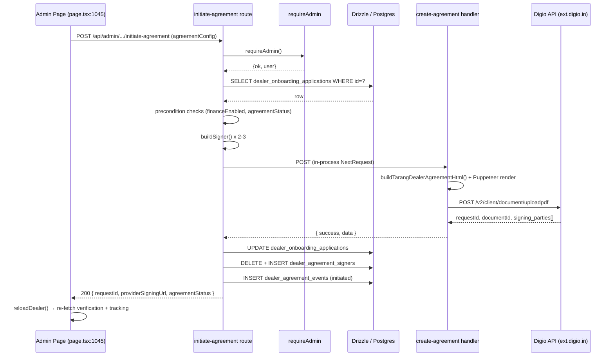

# Initiate Agreement — End-to-End Working Flow

This document maps every moving part involved when an admin clicks **Initiate Agreement** on the dealer verification page. Use it as a reference when triaging errors: each step links to the exact file and line where the behaviour lives.

All paths are relative to the repo root. References use `path:line` so you can Cmd-click them in VS Code.

---

## 1. Overview

`Initiate Agreement` is an admin-only POST. It takes the agreement configuration that the dealer filled in at onboarding **Step 5**, re-hydrates it into a signer/company payload, renders a dealer-finance agreement PDF with Puppeteer, uploads the PDF to **Digio** for sequential e-sign, persists tracking state into three DB tables, and returns the signing URLs to the UI.

There is **no webhook receiver** for Digio callbacks in this repo. Post-initiation status is admin-pulled via the separate `refresh-agreement` route.

Happy-path entry points:
- UI button → `src/app/(dashboard)/admin/dealer-verification/[dealerId]/page.tsx:1045`
- API → `src/app/api/admin/dealer-verifications/[dealerId]/initiate-agreement/route.ts:229`
- Digio integration → `src/app/api/integrations/digio/create-agreement/route.ts`

---

## 2. Trigger point (Frontend)

File: `src/app/(dashboard)/admin/dealer-verification/[dealerId]/page.tsx`

| Concern | Location | Notes |
| --- | --- | --- |
| Button render | `page.tsx:1045` | Only when `!hasInitiatedAgreement` (`:1044`) |
| Loading label | `page.tsx:1049` | "Initiating…" while `agreementActionLoading === "initiate"` |
| Sibling buttons | `:1053` Refresh Status · `:1061` Re-initiate · `:1069` Retry Download | Visible once an agreement exists |
| onClick handler | `handleAgreementAction("initiate")` at `page.tsx:640-683` | Plain `fetch()`, no React Query / Zustand |
| Local state | `agreementActionLoading` (`:420`), `tracking` (`:423`), `trackingLoading` (`:424`) | Component-local React state only |
| Payload build | `page.tsx:644-665` | Reads `data?.agreement` loaded from `GET /api/admin/dealer-verifications/[dealerId]` in the initial `useEffect` at `:443-485` |
| Success | `reloadDealer()` at `:590-603` | Re-fetches verification detail + `agreement-tracking` |
| Failure | `alert(message)` at `:675, :679` | No toast system; uses `window.alert`. Loading reset in `finally` at `:681` |

Payload sent to the API:

```ts
{
  agreementConfig: {
    agreementName, agreementVersion, dateOfSigning, mouDate, financierName,
    dealerSignerName, dealerSignerDesignation, dealerSignerEmail,
    dealerSignerPhone, dealerSigningMethod,
    financierSignatory, itarangSignatory1, itarangSignatory2,
    signingOrder,
    isOemFinancing, vehicleType, manufacturer, brand, statePresence,
  }
}
```

The values originate from the dealer onboarding Step 5 and are persisted in `dealer_onboarding_applications.provider_raw_response.agreement` — that sub-key is preserved across admin actions by `mergeProviderRawResponse()` (see §5).

---

## 3. API entry — `initiate-agreement/route.ts`

File: `src/app/api/admin/dealer-verifications/[dealerId]/initiate-agreement/route.ts`

### 3.1 Sequence

1. **Auth guard** — `requireAdmin()` at `:233`. Implementation in `src/lib/auth/requireAdmin.ts:34`. Allowed roles: `admin`, `ceo`, `business_head`, `sales_head`. Rejects if session missing (401) or role/`is_active` fails (403). Middleware treats `/api/*` as public (`src/middleware.ts`) so every admin handler must self-gate — see the comment at `requireAdmin.ts:7-10`.
2. **Parse body** — `:238-243`. Silently defaults to `{}` if JSON is malformed.
3. **Load application** — `dealerOnboardingApplications` by `dealerId` (`:245-258`). 404 if missing.
4. **Precondition: finance enabled** — `:260-269`. 400 if `financeEnabled !== true`.
5. **Precondition: current state** — `:271-286`. Allowed starting states: `""`, `not_generated`, `failed`, `expired`. Any other state returns 400 with "Use refresh or re-initiate only after failed or expired state." Use the `re-initiate-agreement` route to replace an already-in-flight agreement.
6. **Validate `agreementConfig` present** — `:288-299`.
7. **Build signers** — `buildSigner()` helper at `:83-105`. Rules:
   - `name` required
   - `email` must match basic regex (`:64-66`)
   - `mobile` must be 10–15 digits after stripping non-digits (`:60-71`)
   - Dealer signer + iTarang signer 1 are **required** (`:325-338`)
   - iTarang signer 2 is optional, but if any field was started all fields must be valid (`:340-354`)
8. **Compute `signingOrder`** — `:362-367`. Defaults: `["dealer", "itarang_1"]` or `["dealer", "itarang_1", "itarang_2"]`.
9. **Build `createAgreementPayload`** — `:369-420`. Contains `company`, `ownership`, and `agreement` blocks. `sequential: true`, `expireInDays: 5`.
10. **Invoke Digio handler in-process** — `:434-441`. The route imports `POST as createDigioAgreement` from the Digio integration route and calls it with a synthetic `NextRequest`. Rationale comment at `:427-433`: an earlier `fetch("${origin}/...")` failed on Hostinger because the server couldn't dial its own public URL; the in-process call preserves the real downstream error and keeps the hop on the same Node process.
11. **Validate response** — `:460-469`. Forwards Digio's message + raw body on failure.
12. **Extract response fields** — helpers at `:115-203`:
    - `extractProviderDocumentId()` (`:115`)
    - `extractRequestId()` (`:132`)
    - `extractSigningUrl()` (`:146`)
    - `extractStampStatus()` (`:170`)
    - `extractAgreementStatus()` (`:179`)
    - `extractSignerUrls()` (`:193`)
13. **Guard: `requestId` must be present** — `:494-504`. Returns 500 if extraction fails.
14. **Persist** (see §6 for column meanings):
    - Update `dealer_onboarding_applications` (`:506-526`). Note the normalisation `requested → sent_to_external_party` at `:509-512`.
    - Delete + re-insert per-signer rows in `dealer_agreement_signers` (`:528-607`). Matches signers to Digio's `signing_parties` by email (case-insensitive) via `findSignerByEmail()` (`:532-548`).
    - `insertAgreementEvent({ eventType: "initiated" })` (`:609-619`).
15. **Return 200** — `:621-631`.

### 3.2 Diagnostic logs

All tagged `[DIGIO INITIATE]`:
- Full outbound payload — `:422-425`
- Integration HTTP status + body — `:450-458`
- Extracted fields — `:481-492`
- Top-level catch — `:632-641`

### 3.3 Response shape

```ts
{
  success: true,
  message: "Agreement initiated successfully",
  data: {
    // spread of Digio response body
    requestId,
    providerDocumentId,
    providerSigningUrl,          // dealer's URL, or first party URL
    agreementStatus,             // "requested" / "sent_for_signature" / ...
  }
}
```

---

## 4. Digio integration — `create-agreement/route.ts`

File: `src/app/api/integrations/digio/create-agreement/route.ts`

- **HTML template** — `buildTarangDealerAgreementHtml()` at `:241`, defined in `src/lib/agreement/dealer-agreement-template.ts`. Escapes input via a local `esc()` helper.
- **PDF render** — `renderPdfFromHtml()` at `:98-120`. Launches Puppeteer, sets page HTML, exports A4 PDF with 14mm margins.
- **Signer validation + duplicate guard** — `:55-82`. Rejects duplicate identifiers (returns 400).
- **Digio upload** — POST `${DIGIO_BASE_URL}/v2/client/document/uploadpdf` at `:324`. Body includes base64 PDF, signers array, `sequential: true`, 5-day expiry.
- **Env vars** — `DIGIO_CLIENT_ID`, `DIGIO_CLIENT_SECRET`, `DIGIO_BASE_URL`. Default base URL `https://ext.digio.in:444` at `:147`.
- **Response normalisation** — `:367-402`. Extracts `requestId`, `documentId`, per-signer `signing_parties[].authentication_url`, overall status. Normalises to `completed` / `partially_signed` / `sent_for_signature`.
- **Failure modes**:
  - Missing Digio env → 500 "Missing Digio configuration"
  - Invalid / duplicate signers → 400
  - Puppeteer launch error → 500
  - Digio API error → forwards Digio's `error_msg`/`message`/`error`

---

## 5. Supporting libraries

| File | Exports | Role in this flow |
| --- | --- | --- |
| `src/lib/auth/requireAdmin.ts` | `requireAdmin()` (`:34`) | Supabase session + `users.role` + `users.is_active` check |
| `src/lib/agreement/tracking.ts` | `insertAgreementSigners()` (`:22`), `insertAgreementEvent()` (`:45`) | Batch DB writes for signers and audit events; defaults `signerStatus` to `"pending"` |
| `src/lib/agreement/providerRaw.ts` | `mergeProviderRawResponse()` (`:36`) | Merges Digio body into the JSONB column while preserving `.agreement` and `.submissionSnapshot` sub-keys written at submission time. See the header comment at `:1-9` for the why. |
| `src/lib/agreement/sync-signers.ts` | `syncSignersFromDigio()`, `fetchDigioAndSyncSigners()` | Used by `refresh-agreement`, **not** by `initiate-agreement` |
| `src/lib/agreement/status.ts` | `canReInitiateAgreement()` | Gates the re-initiate route; allows only `failed` / `expired` |
| `src/lib/agreement/dealer-agreement-template.ts` | `buildTarangDealerAgreementHtml()` | PDF HTML source |

---

## 6. Database schema

File: `src/lib/db/schema.ts`

### `dealer_onboarding_applications` (~`:2742-2813`)

Columns written by the initiate route:

| Column | Written to | Notes |
| --- | --- | --- |
| `agreementStatus` | normalised from Digio response | `requested → sent_to_external_party` (`route.ts:509-512`) |
| `reviewStatus` | `"pending_admin_review"` | |
| `completionStatus` | `"pending"` | |
| `providerDocumentId` | Digio document id | Falls back to `requestId` if not returned |
| `requestId` | Digio request id | Required — 500 if missing |
| `providerSigningUrl` | dealer signing URL | From `extractSigningUrl()` |
| `providerRawResponse` (jsonb) | merged via `mergeProviderRawResponse()` | Preserves `.agreement` / `.submissionSnapshot` |
| `stampStatus` | Digio value or `"pending"` | |
| `lastActionTimestamp`, `updatedAt` | `new Date()` | |

### `dealer_agreement_signers` (~`:2815-2851`)

One row per signer (dealer + 1 or 2 iTarang signatories):

- `signerRole` — `"dealer"`, `"itarang_signatory_1"`, `"itarang_signatory_2"`
- `signerName`, `signerEmail`, `signerMobile`, `signingMethod`
- `providerSignerIdentifier` — email (preferred) or mobile
- `providerSigningUrl` — per-signer `authentication_url`
- `signerStatus` — normalised via `normalizeSignerStatus()` at `route.ts:205-213` (`requested`/`sequenced` → `sent`)
- `providerRawResponse` (jsonb) — raw Digio party object

The route does `DELETE WHERE applicationId = ?` first (`route.ts:528-530`) so repeated initiations leave a clean set.

### `dealer_agreement_events` (~`:2853-2879`)

Audit trail, append-only. This route writes one row:

```ts
{
  applicationId: dealerId,
  providerDocumentId,
  requestId,
  eventType: "initiated",
  eventStatus: agreementStatus === "requested" ? "sent_to_external_party" : agreementStatus,
  eventPayload: responseData,
}
```

---

## 7. Post-initiation lifecycle (for context)

| Action | Route | Behaviour |
| --- | --- | --- |
| Refresh status | `src/app/api/admin/dealer-verifications/[dealerId]/refresh-agreement/route.ts` | Fetches `/v2/client/document/{id}` from Digio, runs `syncSignersFromDigio()`, caches signed PDF + audit trail to Supabase storage on completion |
| Status probe | `src/app/api/integrations/digio/agreement-status/route.ts` | Stateless GET by `requestId` or `providerDocumentId` |
| Re-initiate | `src/app/api/admin/dealer-verifications/[dealerId]/re-initiate-agreement/route.ts` | Guarded by `canReInitiateAgreement()`; allowed only when status is `failed` or `expired`. Delegates to initiate in-process with a fresh payload |
| Cancel | `src/app/api/admin/dealer-verifications/[dealerId]/cancel-agreement/route.ts` | Uses the same `mergeProviderRawResponse()` helper to preserve `.agreement` |

**No cron / webhook receiver is wired up** for Digio callbacks. Status changes surface only when the admin hits **Refresh Status**.

---

## 8. Failure-mode triage cheat sheet

| Symptom | HTTP | Where it fires | Likely fix |
| --- | --- | --- | --- |
| `Unauthorized` | 401 | `requireAdmin.ts:40-48` | Log in as an admin |
| `Forbidden` | 403 | `requireAdmin.ts:63-71` | Check `users.role` / `users.is_active` |
| `Application not found` | 404 | `route.ts:253-258` | Verify `dealerId` URL segment |
| `Agreement can only be initiated for finance-enabled…` | 400 | `route.ts:260-269` | Flip `finance_enabled` on the application |
| `Agreement already exists…` | 400 | `route.ts:271-286` | Use refresh; or re-initiate if `failed`/`expired` |
| `agreementConfig is required…` | 400 | `route.ts:290-299` | UI should have built the body from `data?.agreement`; inspect the request payload |
| `Dealer and iTarang Signer 1 must have valid name, email, and phone.` | 400 | `route.ts:325-338` | Check Step 5 values against `buildSigner()` rules (`:83-105`) |
| `iTarang Signer 2 is optional, but if provided…` | 400 | `route.ts:345-354` | Fill all 3 fields or clear all 3 |
| `Failed to initiate Digio agreement` | 500 | `route.ts:460-469` | Read `raw` from the response — check Digio env vars, Puppeteer, signer rules |
| `Digio agreement was created but requestId could not be extracted.` | 500 | `route.ts:494-504` | Digio response shape regression; inspect `raw` |
| Opaque `fetch failed` | — | Pre-fix behaviour on Hostinger | Shouldn't occur now; see `route.ts:427-433`. Confirm you're on the in-process call path |
| Top-level crash | 500 | `route.ts:632-641` | Check server logs for the `INITIATE AGREEMENT ERROR:` line |

When triaging a live failure, grep server logs for `[DIGIO INITIATE]` and `INITIATE AGREEMENT ERROR:` — those two tags cover every branch of this flow.

---

## 9. Sequence diagram



---

## 10. Environment variables

Required for the flow to succeed end-to-end:

| Var | Used by | Notes |
| --- | --- | --- |
| `DIGIO_CLIENT_ID` | `create-agreement` route | |
| `DIGIO_CLIENT_SECRET` | `create-agreement` route | |
| `DIGIO_BASE_URL` | `create-agreement` route | Defaults to `https://ext.digio.in:444` |
| `DATABASE_URL` | Drizzle | Supabase pooled connection |
| `NEXT_PUBLIC_SUPABASE_URL` | Supabase client | |
| `NEXT_PUBLIC_SUPABASE_ANON_KEY` | Supabase client | |
| `SUPABASE_SERVICE_ROLE_KEY` | Server-side auth checks | |

A `.env.test.local` file is committed for test-suite use; do not rely on it for local dev.

---

## 11. Files involved (quick index)

- `src/app/(dashboard)/admin/dealer-verification/[dealerId]/page.tsx`
- `src/app/api/admin/dealer-verifications/[dealerId]/initiate-agreement/route.ts`
- `src/app/api/admin/dealer-verifications/[dealerId]/re-initiate-agreement/route.ts`
- `src/app/api/admin/dealer-verifications/[dealerId]/refresh-agreement/route.ts`
- `src/app/api/admin/dealer-verifications/[dealerId]/cancel-agreement/route.ts`
- `src/app/api/integrations/digio/create-agreement/route.ts`
- `src/app/api/integrations/digio/agreement-status/route.ts`
- `src/lib/auth/requireAdmin.ts`
- `src/lib/agreement/tracking.ts`
- `src/lib/agreement/providerRaw.ts`
- `src/lib/agreement/sync-signers.ts`
- `src/lib/agreement/status.ts`
- `src/lib/agreement/dealer-agreement-template.ts`
- `src/lib/db/schema.ts` (tables `dealer_onboarding_applications`, `dealer_agreement_signers`, `dealer_agreement_events`)
- `src/middleware.ts` (confirms `/api/*` is public — self-gating required)
