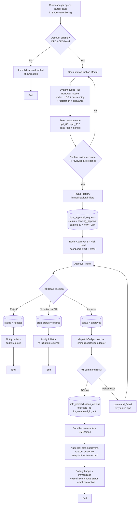
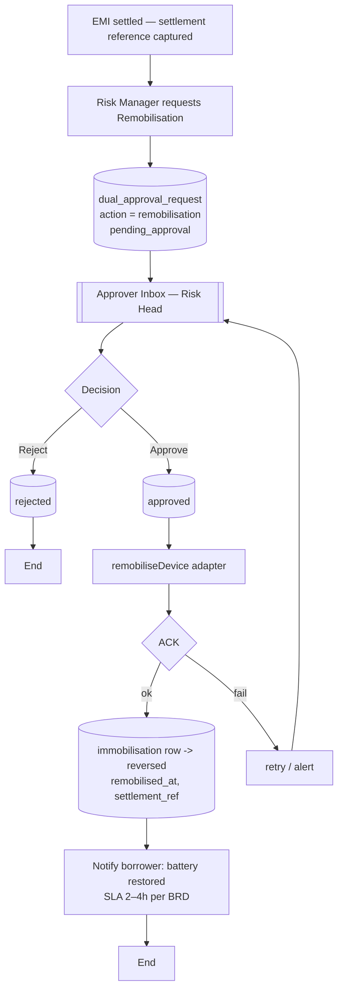
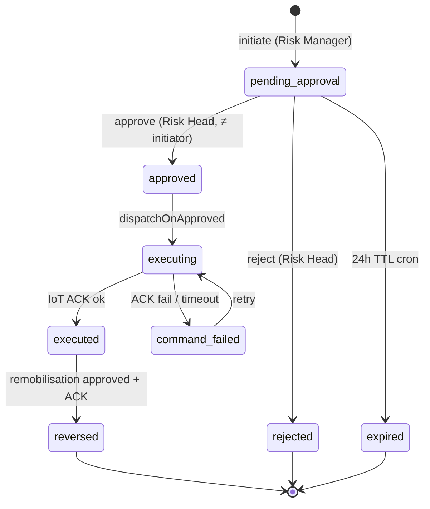
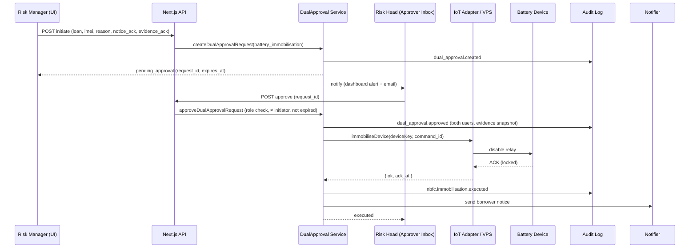
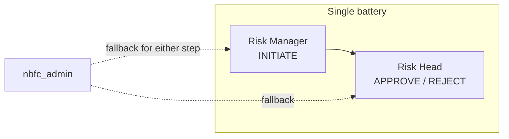
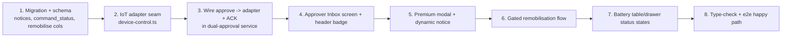

# NBFC Battery Immobilisation — Implementation Plan

**Owner:** iTarang Engineering
**Status:** Draft for approval
**Scope of this pass:** Core single-battery immobilisation, end-to-end, with a real device command and a dual-approval Approver Inbox.
**Compliance basis:** RBI Digital Lending Directions 2025 · DPDPA 2023 · BRD §6.1.6 / §6.4.3

---

## 1. What this is

Immobilisation = the NBFC partner remotely disabling the financed **smart EV battery** (via its IoT device) when a borrower defaults, and re-enabling it ("remobilisation") once the EMI is settled. Because remotely switching off a customer's vehicle is heavily regulated, every immobilisation must pass a **two-person (dual) approval gate**, show a **mandatory borrower notice**, and be written to an **immutable audit log**.

### Locked decisions

| # | Decision | Choice |
|---|----------|--------|
| 1 | Device effect | **Real device command** via an IoT adapter (with an ACK feedback loop). |
| 2 | Build scope | **Core single-battery flow + Approver Inbox** (bulk + analytics deferred). |
| 3 | Approvers | **Risk Manager → Risk Head** (BRD §6.4.3); `nbfc_admin` allowed as fallback for testability. |

---

## 2. Build on what exists — do not rebuild

| Already built (reuse) | Gap to close in this pass |
|---|---|
| Dual-approval engine (`dual_approval_requests`, 24h TTL, role gate, initiator≠approver, audit) | **Approver Inbox UI** — Approver 2 has nowhere to review/approve/reject |
| `battery-immobilisation/initiate` route | **Real IoT command + ACK** (today `iot_command_id` is a stub) |
| `ImmobilisationModal`, `ModalShell`, `CaseWorkspaceSheet`, `AuditTrailPreview` | **Dynamic RBI borrower notice** (today hardcoded) |
| `nbfc_immobilisation_actions`, `nbfc_audit_log` | **Gated remobilisation** flow (settlement → dual approval → re-enable) |
| Design tokens (`--color-brand-*`, `status-pill-*`, `card-iTarang`, `ResponsiveTable`, `ScoreBadge`) | **Consolidate** the older `nbfc_borrower_actions` path onto the dual-approval engine |

---

## 3. End-to-end flow (single battery)



### Remobilisation (re-enable after settlement)



---

## 4. Dual-approval state machine



**Invariant:** nothing between the two approvals changes the outcome. First approval only *submits for review*; the second approval *executes*. Approver must differ from initiator and must hold the required role.

---

## 5. Request → execute sequence (with real device + ACK)



---

## 6. Data model

### Reused tables
- **`dual_approval_requests`** — the gate. Columns used: `action_type` (`battery_immobilisation` | `remobilisation`), `entity_id` (loan id), `initiator_user_id`, `approver_user_id`, `required_approver_role`, `status`, `reason_code`, `evidence_snapshot` (jsonb), `borrower_notice_id`, `expires_at`, `approved_at`/`rejected_at`/`expired_at`.
- **`nbfc_immobilisation_actions`** — execution record: `loan_application_id`, `imei`, `approval_request_id`, `iot_command_id`, `executed_at`, `borrower_notified_at`.
- **`nbfc_audit_log`** / **`audit_logs`** — immutable trail.
- **`iot_devices`** — device registry (`imei_id`, `serial_number`, `device_status`, telemetry).
- **`loan_sanctions`** — `recovery_flagged_at`, `recovery_reason`.

### New columns / table (migration `E-XXX_immobilisation_device_command.sql`, additive + idempotent)
- `nbfc_immobilisation_actions.command_status` — `pending | acked | failed` (device ACK state).
- `nbfc_immobilisation_actions.command_acked_at` — timestamptz.
- `nbfc_immobilisation_actions.command_error` — text (last failure reason).
- `nbfc_immobilisation_actions.remobilised_at`, `.settlement_reference` — remobilisation record.
- **`nbfc_borrower_notices`** — `id`, `tenant_id`, `loan_application_id`, `lender_legal_name`, `lsp_name`, `outstanding_amount`, `restoration_steps`, `grievance_url`, `helpline`, `notice_text`, `channel`, `sent_at`, `created_at`. (Materialise the RBI notice so the exact text shown to the borrower is auditable.)

> Per `CLAUDE.md`: hand-written `E-` migration, all DDL `IF NOT EXISTS`, strictly additive; mirror into `src/lib/db/schema.ts`. Do **not** `db:push`.

---

## 7. IoT adapter contract (the real-command seam)

All device I/O goes through one module — `src/lib/nbfc/iot/device-control.ts` — so the rest of the system never knows the VPS specifics.

```ts
interface DeviceControl {
  immobilise(input: {
    deviceKey: string;        // imei | serial_number | device_id (TBD)
    commandId: string;        // our idempotency key
    reason: string;
  }): Promise<{ ok: boolean; ackAt?: string; error?: string }>;

  remobilise(input: {
    deviceKey: string;
    commandId: string;
    settlementRef: string;
  }): Promise<{ ok: boolean; ackAt?: string; error?: string }>;
}
```

**Needed from the IoT team to make it truly live (otherwise the adapter ships as a typed stub the team fills in):**
1. VPS endpoint URLs + HTTP method for immobilise / remobilise.
2. Auth (API key / bearer / mTLS).
3. Device addressing key — `imei`, `serial_number`, or `device_id`.
4. ACK model — synchronous response, or async (poll / webbook) with a callback we expose.

Until those land, `command_status` stays `pending` and the UI shows "Awaiting device confirmation" — the approval + audit + notice flow is fully functional regardless.

---

## 8. API surface

| Method · Route | Purpose | Gate |
|---|---|---|
| `POST /api/nbfc/actions/battery-immobilisation/initiate` | Risk Manager raises request (reuse) | role: risk_manager |
| `GET  /api/nbfc/dual-approval/requests?status=pending_approval` | Approver Inbox list (reuse) | role: risk_head |
| `POST /api/nbfc/dual-approval/requests/:id/approve` | Risk Head approves → execute (reuse + wire adapter) | role: risk_head, ≠ initiator |
| `POST /api/nbfc/dual-approval/requests/:id/reject` | Risk Head rejects (reuse) | role: risk_head |
| `POST /api/nbfc/actions/immobilisation/remobilise` | Request remobilisation (upgrade to dual-approval) | risk_manager → risk_head |
| `GET  /api/nbfc/dual-approval/cron/expire` | Expire stale requests (reuse) | cron |
| `POST /api/nbfc/actions/immobilisation/command-callback` | (only if IoT is async) device ACK webhook | signed |

---

## 9. RBAC



- Initiator and approver **must be different users**.
- Roles resolved by `resolveActor()`; `nbfc_admin` permitted on both steps so the flow is testable on tenants without distinct risk roles seeded.

---

## 10. Borrower notice (RBI-mandatory, dynamic)

Before the request can be submitted, the modal must render and the initiator must confirm a notice containing all five:

1. **Lender identity** — NBFC legal name.
2. **LSP identity** — iTarang Battery Solutions.
3. **Outstanding amount + restoration steps** — "Pay ₹X to restore within 2–4h."
4. **Grievance channel** — URL + helpline.
5. **Plain, non-coercive language.**

The exact rendered text is persisted to `nbfc_borrower_notices` and linked from the approval + audit record.

---

## 11. UI / screens

1. **Premium Immobilisation Modal** (upgrade existing): dynamic notice, reason code, evidence summary (CDS/PCI/EMI/telemetry), dual-approval explainer with SLA, token-based styling (replace inline `bg-sky-500` with `.btn-*`), clear pending/failed states.
2. **Approver Inbox** (new) — `/nbfc/approvals`: list of pending requests with **SLA countdown**, evidence panel (read-only), Approve / Reject (reason required), and a "approved/rejected/expired" history tab. Also surfaced as a badge in `NbfcPortalHeader` work queue.
3. **Battery case drawer / table** — status badges (`Immobilisation Pending`, `Immobilised`, `Awaiting device ACK`, `Remobilised`, `Rejected`) and the gated **Remobilise** action once executed.

---

## 12. Compliance checklist

- ✅ Two-person rule enforced server-side (role + initiator≠approver + expiry).
- ✅ Borrower notice shown, confirmed, and persisted.
- ✅ Immutable audit on create / approve / reject / expire / execute / remobilise, with both approvers + evidence snapshot.
- ✅ 24h approval timeout.
- ✅ Restoration SLA messaging (2–4h after settlement).
- ✅ DPDPA: purpose-limited data, India-region storage; no new PII surfaced.

---

## 13. Build order



---

## 14. Open items — need from you

1. **IoT contract** (endpoints, auth, device key, ACK model) — or confirm we ship the adapter as a typed stub for your IoT team to fill.
2. **Approver users** — confirm distinct Risk Manager + Risk Head logins exist for this tenant, or rely on the `nbfc_admin` fallback for testing.
3. **Approver Inbox placement** — standalone `/nbfc/approvals` sidebar item (recommended) vs. nested under Risk Alerts / Recovery.

---

*Generated as a planning artefact. No application code changed by this document.*
