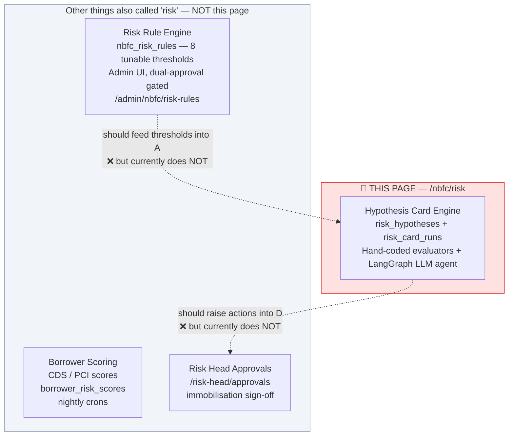
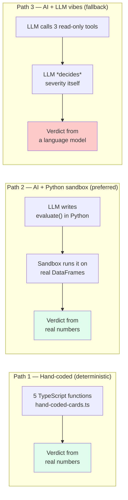
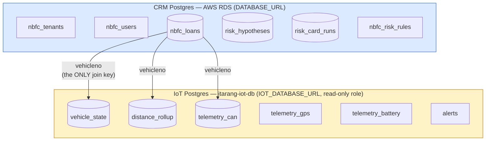
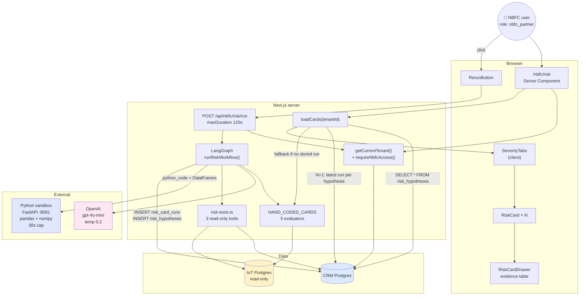
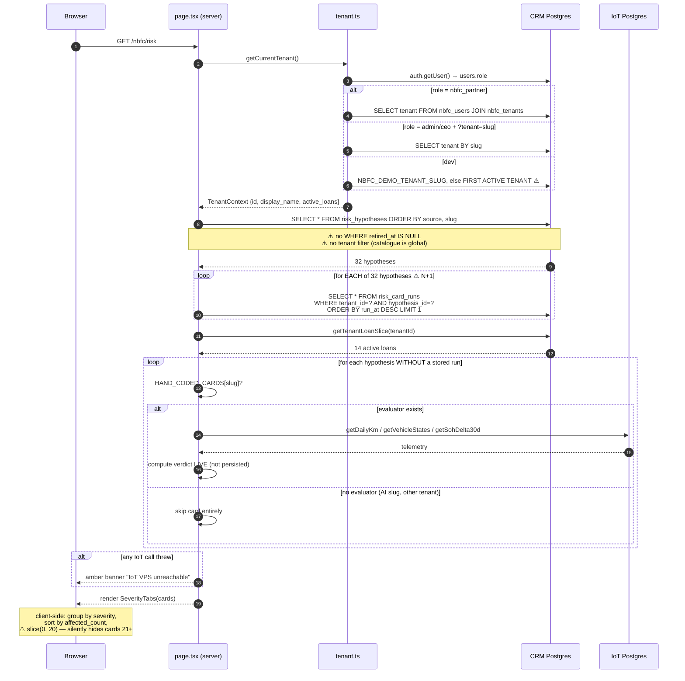
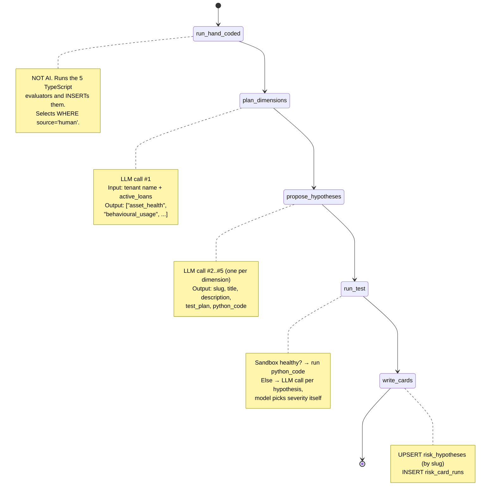
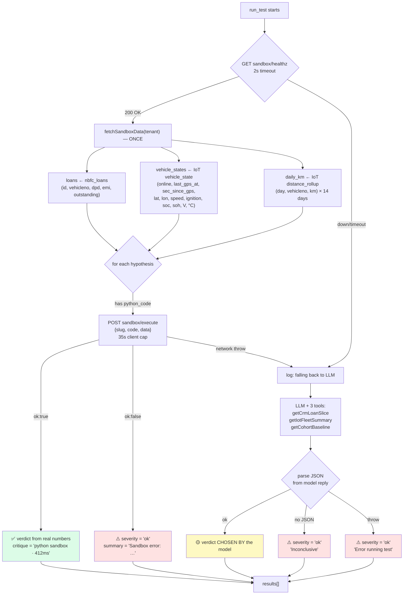
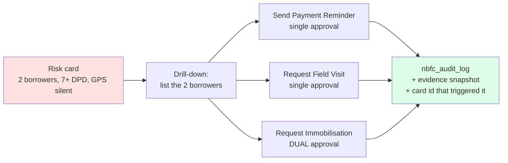

# The NBFC Risk Engine — Complete System Design

**Page:** `localhost:3000/nbfc/risk` → "Risk — Hypothesis-driven cards"
**Audience:** anyone who needs to understand, debug, or extend this page
**Written:** 2026-07-10
**Status of the system:** working prototype wired to real data, with several correctness and compliance gaps documented in §9.
**Companion:** [`RISK_ENGINE_INFRASTRUCTURE.md`](./RISK_ENGINE_INFRASTRUCTURE.md) — the VPS/telemetry stack behind this page (poller, TimescaleDB, aggregator, risk-sandbox) and which of those pieces is actually running. Read that one if the page shows an amber banner or every AI card says "Inconclusive".

---

## Table of contents

1. [The one-paragraph summary](#1-the-one-paragraph-summary)
2. [Every term on this page, explained](#2-every-term-on-this-page-explained)
3. [The three engines (and the two that are NOT this page)](#3-the-three-engines)
4. [The two databases](#4-the-two-databases)
5. [System design — the built system](#5-system-design--the-built-system)
6. [Flow A: what happens when you open the page (read path)](#6-flow-a-opening-the-page-read-path)
7. [Flow B: what happens when you click "Re-run analysis" (write path)](#7-flow-b-re-run-analysis-the-agentic-write-path)
8. [Complete data lineage — every column, in and out](#8-complete-data-lineage)
9. [A full worked example](#9-a-full-worked-example)
10. [What is wrong with it](#10-what-is-wrong-with-it)
11. [What we should add](#11-what-we-should-add)
12. [Target system design (v2)](#12-target-system-design-v2)
13. [File map](#13-file-map)

---

## 1. The one-paragraph summary

The Risk page shows a grid of **cards**. Each card is the answer to one **hypothesis** — a testable
statement like *"borrowers who are 7+ days late on EMI AND whose vehicle has stopped sending GPS are
hiding the asset."* To answer it, the system pulls **loan data** from the CRM database and **vehicle
telemetry** from a separate IoT database, runs a **test** over the two joined together, and writes the
verdict — a colour (High / Warning / OK), a count, and the raw evidence rows — into the table
`risk_card_runs`. The page then reads the most recent verdict per hypothesis and renders it.

There are two ways a hypothesis can exist and be tested:

- **Hand-coded** (5 of them) — a TypeScript function a human wrote. Deterministic. `source = 'human'`.
- **AI-generated** (everything else) — an LLM agent invents the hypothesis, writes Python to test it,
  and a sandbox runs that Python against real data. `source = 'llm-v1'`.

Both write into the *same* table and render as the *same* card shape. The only visual difference is a
small grey **`AI`** badge on the agent-generated ones.

Nothing recalculates on a schedule. **The numbers on the page only change when a human clicks
"Re-run analysis."**

---

## 2. Every term on this page, explained

Below is the screenshot, annotated. Each label is explained underneath.

```
┌──────────────────────────────────────────────────────────────────────────────────┐
│  Risk                                            ⑦ 7 cards in 8,046 tokens       │
│  Hypothesis-driven cards. ② 32 active hypotheses for ① iTarang Finance.          │
│                                                            ⑧ [Re-run analysis]   │
│  ─────────────────────────────────────────────────────────────────────────────   │
│  ③ High Alert  2   |   Warning  0   |   OK  30                                    │
│                                                                                   │
│  ┌────────────────────────────────┐  ┌────────────────────────────────┐          │
│  │ ④ HIGH ALERT                   │  │ ④ HIGH ALERT                   │          │
│  │ ⑤ Active loan, low utilization │  │ ⑤ Past-due + telemetry silent  │          │
│  │ ⑥ 5 of 5 telemetry-reporting   │  │ ⑥ 2 borrowers are 7+ DPD and   │          │
│  │    vehicles averaged <20 km/day │  │    have not reported GPS 6h+   │          │
│  │ ⑨ 5 / 5 affected               │  │ ⑨ 2 / 3 affected               │          │
│  │ ⑩ ████████████████████ 100%    │  │ ⑩ ██████████████░░░░░░ 66%     │          │
│  └────────────────────────────────┘  └────────────────────────────────┘          │
│                                                                                   │
│  BRD §6.1.6                                                                       │
│  ⑪ Risk Action Framework  (static reference table — not clickable)                │
└──────────────────────────────────────────────────────────────────────────────────┘
```

| # | Term on screen | What it actually is | Where it comes from |
|---|---|---|---|
| ① | **iTarang Finance** | The **tenant**. An NBFC (a lending company) that uses this portal. Every number on the page is filtered to this tenant's loans only. | `nbfc_tenants.display_name`, resolved by `getCurrentTenant()` |
| ② | **32 active hypotheses** | The number of cards rendered = number of rows in `risk_hypotheses` that have either a stored result or a hand-coded evaluator. Despite the word "active", **retired hypotheses are not filtered out.** | `cards.length` in `page.tsx` |
| ③ | **High Alert / Warning / OK** | **Severity.** Not a judgement of how bad the problem is — purely *what fraction of the population is affected*. See the severity table below. | `risk_card_runs.severity` |
| ④ | **HIGH ALERT** badge | Same severity value, rendered as a coloured chip. | `SEVERITY_COLOR_TOKENS` in `severity.ts` |
| ⑤ | **Card title** | The human-readable name of the hypothesis. | `risk_hypotheses.title` |
| ⑥ | **Finding summary** | One sentence describing what the test found *this run*. Written by the evaluator (hand-coded) or by the sandbox/LLM (AI). | `risk_card_runs.finding_summary` |
| ⑦ | **"7 cards in 8,046 tokens"** | Result of the **last click** of Re-run analysis. `7` = how many *AI* hypotheses the agent generated and tested. `8,046` = OpenAI prompt + completion tokens burned. It is **not** the total cards on the page. | Returned by `POST /api/nbfc/risk/run` |
| ⑧ | **Re-run analysis** | The only trigger in the entire system. Runs the full LangGraph agent workflow synchronously, blocking for 30–120 seconds. | `RerunButton.tsx` |
| ⑨ | **`5 / 5 affected`** | `affected_count / total_count`. **The denominator is not the same thing on every card** — see §10.3. | `risk_card_runs.affected_count`, `.total_count` |
| ⑩ | **Progress bar** | `affected_count ÷ total_count`, capped at 100%. Purely visual. | Computed in `RiskCard.tsx` |
| ⑪ | **Risk Action Framework** | A **hard-coded static table** listing which approvals each action needs. It is documentation. There are no buttons. It is not connected to the cards above it. | `ACTION_ROWS` constant in `RiskActionFramework.tsx` |

### Domain terms

| Term | Plain English |
|---|---|
| **Hypothesis** | A guess we can test with data. *"Vehicles doing under 20 km/day probably aren't earning enough to pay the EMI."* |
| **Card** | The result of testing one hypothesis, for one tenant, at one moment in time. One row of `risk_card_runs`. |
| **Evidence** | The actual rows that triggered the finding (up to 10), plus methodology notes. Stored as JSON. Shown in the side drawer when you click a card. |
| **DPD** | **D**ays **P**ast **D**ue. How many days late the borrower's EMI is. `nbfc_loans.current_dpd`. |
| **EMI** | Equated Monthly Instalment — the fixed monthly loan payment. |
| **Telemetry** | Data the vehicle's IoT device sends: GPS position, speed, battery state. |
| **Telemetry silent** | The vehicle has not sent a GPS fix recently (here: 6+ hours). Either the device died, or someone disconnected it. |
| **SOC** | **S**tate **o**f **C**harge — how full the battery is right now (%). |
| **SOH** | **S**tate **o**f **H**ealth — how much capacity the battery has lost permanently (%). 100% = new. Below ~60% = end of life. |
| **vehicleno** | The vehicle registration number. **This is the join key** between the CRM database and the IoT database. |
| **Immobilisation** | Remotely disabling the vehicle's battery so it can't be driven. The nuclear option for recovery. Heavily regulated. |

### How severity is decided

Severity is **purely a percentage of the population**, and each card uses different cutoffs:

```
                          HIGH if ≥        WARN if ≥       else OK
usage-drop-7d               5%               1%
dpd-7-no-telemetry          3%               1%
geo-shift                   0.5%             0.1%
battery-soh-decay           2%               0.5%
low-utilization-active-loan 10%              4%
AI-generated (prompt says)  5%               1%
```

Source: `pickSeverity()` in `hand-coded-cards.ts:58`.

> ⚠️ **Severity is not severity.** A card saying "1 borrower is about to default on ₹4 lakh" will
> show **OK** if you have 500 loans, because 1/500 = 0.2%. A card saying "5 of 5 vehicles are idle"
> shows **HIGH** even if those 5 vehicles are all fully paid up. The colour measures *prevalence*,
> not *money at risk*.

---

## 3. The three engines

The word "risk engine" is used for three different things in this codebase. Only the first one
powers this page.



Those dotted lines are the two biggest architectural holes. The Risk page invents its own thresholds
in hard-coded TypeScript, ignoring the eight thresholds a Risk Head can configure and that require
dual approval to change. And the cards it produces cannot be acted upon.

### Inside engine A, there are three ways a card gets computed



Path 3 fires whenever the Python sandbox is unreachable (`NBFC_SANDBOX_URL`, default
`http://127.0.0.1:8091`). **The page gives you no indication which path produced a card.** In local
dev the sandbox is almost never running, so nearly every AI card on your screen right now came from
Path 3 — a language model choosing "high" or "ok" from tool output.

---

## 4. The two databases

This is the single most important thing to understand about the page: **it joins across two
completely separate Postgres servers, over the network, with no foreign key between them.**



> Where does the IoT data come from in the first place, and who fills those tables? A poller, a
> Timescale continuous aggregate, and an aggregator cron that never ran — see
> [`RISK_ENGINE_INFRASTRUCTURE.md`](./RISK_ENGINE_INFRASTRUCTURE.md).

**The join is done in application memory, not in SQL.** The code:

1. Reads `nbfc_loans` for the tenant → gets a list of `vehicleno` strings.
2. Passes that array into an IoT query: `WHERE vehicleno = ANY($1)`.
3. Zips the two result sets together in a JavaScript `Map`.

This is why every hand-coded evaluator can throw "IoT VPS unreachable" and why the page has a
dedicated amber banner for it. It is also why you need `ssh -N iot-bastion` running locally before
any of this works.

### The five CRM tables that matter

**`nbfc_tenants`** — one row per NBFC.

| Column | Used for |
|---|---|
| `id` (uuid, PK) | Scopes everything. Written into `risk_card_runs.tenant_id`. |
| `display_name` | Page header: "for **iTarang Finance**" |
| `active_loans` | Fed to the LLM in the `plan_dimensions` prompt |
| `nbfc_legal_name`, `grievance_url`, `grievance_helpline` | The RBI borrower-notice preview at the bottom |

**`nbfc_loans`** — one row per loan. This is the **population** every card measures.

| Column | Type | Read by |
|---|---|---|
| `loan_application_id` | varchar PK | evidence rows, sandbox `loans` DataFrame |
| `tenant_id` | uuid | the tenant filter — `WHERE tenant_id = ? AND is_active = true` |
| `vehicleno` | varchar | **the join key to IoT** |
| `current_dpd` | integer | `dpd-7-no-telemetry` (≥ 7) |
| `emi_amount` | numeric(12,2) | `low-utilization-active-loan` (> 0) |
| `outstanding_amount` | numeric(14,2) | passed to the LLM/sandbox; **never actually used in any verdict** |
| `is_active` | boolean | every query filters on `= true` |

**`risk_hypotheses`** — the catalogue of questions. Global, **not tenant-scoped**.

| Column | Notes |
|---|---|
| `id` (uuid) | FK target of `risk_card_runs.hypothesis_id` |
| `slug` (text, UNIQUE) | `usage-drop-7d`, etc. Maps to the `HAND_CODED_CARDS` lookup. |
| `title`, `description` | Rendered on the card and in the drawer |
| `test_method` | varchar(16). Always `'js'` — **even for Python hypotheses.** |
| `test_definition` | jsonb. For humans: `{"kind":"hand_coded","fn":"usageDrop7d"}`. For AI: `{"kind":"llm_generated","test_plan":"..."}` — **the actual Python code is never stored.** |
| `source` | `'human'` (5 seeded rows) or `'llm-v1'` (everything the agent invents) |
| `retired_at` | timestamptz. **Written by nothing. Read by nothing.** |

**`risk_card_runs`** — the append-only result log. One row per (hypothesis × tenant × run).

| Column | Written by | Read by |
|---|---|---|
| `tenant_id`, `hypothesis_id` | both paths | page query |
| `run_at` | `DEFAULT now()` | "Last computed" in drawer; `ORDER BY run_at DESC LIMIT 1` |
| `severity` | evaluator / sandbox / LLM | tab counts + card colour |
| `finding_summary` | evaluator / sandbox / LLM | card body |
| `affected_count`, `total_count` | evaluator / sandbox / LLM | the big number + progress bar |
| `evidence_json` | evaluator / sandbox / LLM | drawer table + methodology notes |
| `llm_critique` | LLM path only | **nothing — never rendered** |
| `llm_model` | `'gpt-4o-mini'` or the literal string `'hand-coded'` | nothing |
| `llm_prompt_tokens`, `llm_completion_tokens` | the **whole run's** total, copied onto **every** card row | nothing |

**`nbfc_risk_rules`** — 8 tunable thresholds, dual-approval gated (migration `E-067`).

| `rule_key` | value | unit | Read by the Risk page? |
|---|---|---|---|
| `usage_drop_pct` | 40 | pct | ❌ **No** — hard-coded `0.4` in `hand-coded-cards.ts:86` |
| `geo_shift_km` | 100 | km | ❌ **No** — the card uses an India bounding box instead |
| `offline_alert_hours` | 24 | hours | ❌ **No** — hard-coded `6 * 3600` seconds |
| `emi_overdue_days` | 30 | days | ❌ **No** — hard-coded `>= 7` |
| `cds_low_medium` / `cds_medium_high` / `cds_high_very_high` | 40 / 70 / 85 | score | n/a — used by the scoring engine |
| `pci_concern` | 0.40 | score | n/a |

**Every single threshold this page uses is hard-coded and cannot be changed by a Risk Head.**

---

## 5. System design — the built system



### Trust boundaries

| Boundary | What crosses it | Protection |
|---|---|---|
| Browser → Next | tenant identity | Supabase session cookie; `requireNbfcAccess()` verifies `nbfc_users` membership |
| Next → OpenAI | tenant name, loan counts, **tool output containing `loan_application_id` + `vehicleno`** | none — sent as prompt text |
| Next → Sandbox | LLM-authored Python + full tenant DataFrames | sandbox is meant to be isolated; **no auth on the HTTP call** |
| Next → IoT DB | vehicleno array | `dashboard_ro` role, SELECT only, TLS |
| LLM → DB | nothing directly | the agent gets 3 whitelisted tools, never raw SQL ✅ (this part is well designed) |

---

## 6. Flow A: opening the page (read path)

This is what happens on every page load. **No AI runs here. No telemetry is re-read unless a card
has never been computed.**



**Key consequence:** once a card has *ever* been persisted by a Re-run, the page **stops recomputing
it**. It shows the stored row forever, however old. There is no freshness check, no max age, and no
"stale" badge on the card face. A three-week-old High Alert looks identical to one computed a minute
ago.

---

## 7. Flow B: "Re-run analysis" — the agentic write path

This is the LangGraph workflow. It is a **linear chain** — despite the module doc-block claiming
`plan → propose → fetch_data → run_test → critique → score → write_card`, the `fetch_data`,
`critique`, and `score` nodes **do not exist in the compiled graph**.



### Node by node

#### Node 0 — `run_hand_coded`

```
INPUT   tenantId
        ↓
        SELECT * FROM risk_hypotheses WHERE source = 'human'     → 5 rows
        getTenantLoanSlice(tenantId)                             → 14 loans
        ↓
        for each: HAND_CODED_CARDS[slug](loans)
            → hits IoT: distance_rollup / vehicle_state / telemetry_can
        ↓
OUTPUT  INSERT INTO risk_card_runs (…, llm_model = 'hand-coded')  × 5
```

If the 5 `source='human'` rows were never seeded into this database (a real incident on
`database-2`), this node inserts nothing, and the page silently shows only AI cards.

#### Node 1 — `plan_dimensions` (LLM call #1)

| | |
|---|---|
| **Input** | `"Tenant: iTarang Finance. Active loans: 14. Pick the dimensions."` |
| **Model** | `gpt-4o-mini`, temperature 0.2 |
| **Output** | JSON array of 3–4 strings, e.g. `["asset_health","behavioural_usage","financial_repayment"]` |
| **On parse failure** | falls back to a hard-coded default triple |
| **Cost** | ~200 tokens |

⚠️ The model sees only two facts (tenant name, loan count). It has no visibility into what the
portfolio actually looks like, so "planning" is essentially a random draw from its priors.

#### Node 2 — `propose_hypotheses` (LLM calls #2…#N, one per dimension)

| | |
|---|---|
| **Input** | one dimension name, plus a long system prompt that documents the three DataFrame schemas |
| **Output** | 1–2 JSON objects per dimension: `{slug, title, description, test_plan, python_code}` |
| **Guardrails in prompt** | must not collide with the 5 existing slugs; only `pandas`/`numpy`; no I/O, no `exec`; under 60 lines; severity rule of thumb ≥5% high, 1–5% warn |
| **Post-processing** | de-dupe by slug within this run only |

Result for a typical run: **7 hypotheses**, matching the "7 cards" in the screenshot.

⚠️ Nothing validates the returned Python before it is executed. Nothing checks that the slug is
novel *across runs* — the catalogue therefore grows every time somebody clicks the button.

#### Node 3 — `run_test`



> 🔴 **Look at the red boxes.** Every failure mode — sandbox crash, unparseable model output,
> thrown exception — resolves to **`severity: "ok"`**. A broken hypothesis is indistinguishable from
> a healthy portfolio. This is almost certainly why the screenshot shows **30 OK** cards.

#### Node 4 — `write_cards`

```
for each result r:
    SELECT id FROM risk_hypotheses WHERE slug = r.slug
    if found  → reuse that id   ⚠️ title/description/code from THIS run are DISCARDED
    if absent → INSERT risk_hypotheses (slug, title, description,
                                        test_method = 'js',            ⚠️ it's Python
                                        test_definition = {kind:'llm_generated', test_plan},
                                                                       ⚠️ python_code NOT stored
                                        source = 'llm-v1')

    INSERT risk_card_runs (tenant_id, hypothesis_id, severity, finding_summary,
                           affected_count, total_count, evidence_json,
                           llm_critique     = r.critique,
                           llm_model        = 'gpt-4o-mini',
                           llm_prompt_tokens     = state.totalPromptTokens,     ⚠️ RUN total
                           llm_completion_tokens = state.totalCompletionTokens) ⚠️ on EVERY row
```

#### Response back to the button

```json
{ "ok": true, "tenant": "itarang-finance",
  "cards_generated": 7, "prompt_tokens": 6120, "completion_tokens": 1926, "errors": [] }
```

`errors` is **always `[]`** — the `errors` annotation is declared in the graph state and no node ever
writes to it.

---

## 8. Complete data lineage

Read this table as: *column in → transform → column out.*

### Card 1 — `usage-drop-7d` ("7-day usage cliff")

| Step | Source | Detail |
|---|---|---|
| Population | `nbfc_loans` | `tenant_id = ? AND is_active = true` → `total` |
| Join key | `nbfc_loans.vehicleno` | non-null only |
| Metric | IoT `distance_rollup.distance_km` | `WHERE bucket_size='day' AND time >= now() - 14 days`, `SUM` grouped by `(day, vehicleno)` |
| Transform | in JS | bucket into `recent` (last 7d) and `prior` (days 8–14) |
| Filter | | skip vehicles with `prior < 50` km (noise floor) |
| Test | | `(prior - recent) / prior >= 0.40` |
| → `affected_count` | | count of droppers |
| → `total_count` | | **all loans** (not just those with telemetry) |
| → `severity` | | `pickSeverity(affected / total, 0.05, 0.01)` |
| → `evidence_json` | | `sample_rows` = top 10 by drop %; `chart` = bar data; `notes` = 2 strings |

### Card 2 — `dpd-7-no-telemetry` ("Past-due + telemetry silent")

| Step | Source | Detail |
|---|---|---|
| Pool | `nbfc_loans.current_dpd` | `>= 7` → `overdue` |
| Join | IoT `vehicle_state` | `WHERE vehicleno = ANY(overdue vehiclenos)` |
| Metric | `EXTRACT(EPOCH FROM now() - last_gps_at)` → `sec_since_gps` | |
| Test | | no state row **OR** `sec_since_gps IS NULL` **OR** `> 21600` (6h) |
| → `affected_count` | | count of concerning |
| → `total_count` | | `overdue.length` — **3** |
| → `severity` | | `pickSeverity(concerning / **all loans** , 0.03, 0.01)` — **14**, not 3 |
| | | 🔴 **The denominator shown to the user is not the denominator that chose the colour.** |

### Card 3 — `geo-shift` ("Vehicle outside operating radius")

| Step | Source | Detail |
|---|---|---|
| Join | IoT `vehicle_state.lat`, `.lon` | |
| Test | | `lat < 6 OR lat > 37 OR lon < 68 OR lon > 97` — **is the vehicle outside India?** |
| → `severity` | | `pickSeverity(outside / total, 0.005, 0.001)` |

🔴 The hypothesis stored in the DB and shown in the drawer says *"more than 100 km from their
onboarding region centroid."* The code checks whether the vehicle is **outside the country**. There
is a configured `geo_shift_km = 100` rule sitting in `nbfc_risk_rules` that this card never reads.
The card will essentially always report **OK**.

### Card 4 — `battery-soh-decay`

| Step | Source | Detail |
|---|---|---|
| Metric | IoT `telemetry_can.payload->'soh'->>'value'` | window function: newest and oldest reading in 30 days |
| Test | | `soh_now - soh_30d_ago <= -5` (5 percentage points) |
| → `total_count` | | `decay.length` = only vehicles with readings at **both** ends |
| → `severity` | | `pickSeverity(concerning / **all loans**, 0.02, 0.005)` — again a different denominator |

Note: SOH is read from `telemetry_can.payload` here, but from `telemetry_battery.soh_pct` in
`deriveBatteryHealthFromTelemetry()`. **Two different sources of truth for the same number.**

### Card 5 — `low-utilization-active-loan`

| Step | Source | Detail |
|---|---|---|
| Pool | `nbfc_loans.emi_amount > 0` | → `activeWithEmi` |
| Metric | IoT `distance_rollup` | 14-day sum per vehicle |
| Coverage split | | vehicle absent from the rollup → `noTelemetry[]`, **excluded** |
| Test | | `total_km / 14 < 20` |
| → `total_count` | | `observable = activeWithEmi - noTelemetry` |
| → `severity` | | `pickSeverity(concerning / observable, 0.10, 0.04)` ✅ consistent denominator |

This is the **best-implemented card**. It explicitly separates "no data" from "zero km" — the fix
that stopped a false `7/7` High Alert. The comment at `hand-coded-cards.ts:220` documents exactly
why.

### AI cards

| Step | Source |
|---|---|
| `loans` DataFrame | `nbfc_loans` — 5 columns |
| `vehicle_states` DataFrame | IoT `vehicle_state` — 12 columns |
| `daily_km` DataFrame | IoT `distance_rollup` — 3 columns, 14 days |
| Test | LLM-authored `evaluate(loans, vehicle_states, daily_km) -> dict` |
| Everything out | whatever the Python (or the model) returns, unvalidated except type coercion |

The agent can only ever see those three DataFrames. It cannot reach `emi_schedules`,
`borrower_risk_scores`, KYC, or bureau data — so it cannot form a hypothesis about repayment history,
income, or credit score.

---

## 9. A full worked example

Let's trace **exactly** what produced the screenshot. Tenant: **iTarang Finance**, 14 active loans.

### Setup — what's in the database

`nbfc_loans WHERE tenant_id = <iTarang Finance> AND is_active = true` → **14 rows**

| loan_application_id | vehicleno | current_dpd | emi_amount | outstanding |
|---|---|---|---|---|
| LN-0001 | MH12AB1234 | 0 | 4,200 | 118,000 |
| LN-0002 | MH12AB1235 | 0 | 4,200 | 96,400 |
| LN-0003 | MH12AB1236 | 12 | 3,800 | 141,200 |
| LN-0004 | MH12AB1237 | 9 | 3,800 | 132,900 |
| LN-0005 | MH12AB1238 | 7 | 4,500 | 155,000 |
| LN-0006 … LN-0014 | (9 more) | 0 | 4,200 | … |

IoT `distance_rollup` has daily rows for only **5** of those 14 vehicles — the other 9 have no
tracker data at all in the last 14 days.

| vehicleno | 14-day total km | avg km/day |
|---|---|---|
| MH12AB1234 | 168 | 12.0 |
| MH12AB1235 | 98 | 7.0 |
| MH12AB1236 | 210 | 15.0 |
| MH12AB1237 | 42 | 3.0 |
| MH12AB1238 | 154 | 11.0 |

IoT `vehicle_state` for the three overdue loans:

| vehicleno | last_gps_at | sec_since_gps |
|---|---|---|
| MH12AB1236 | 3 days ago | 259,200 |
| MH12AB1237 | 14 hours ago | 50,400 |
| MH12AB1238 | 12 minutes ago | 720 |

### Step 1 — user clicks **Re-run analysis**

`POST /api/nbfc/risk/run` → `requireNbfcAccess(tenant.id)` passes → `runRiskWorkflow(tenant)`

### Step 2 — `run_hand_coded`

**Card `low-utilization-active-loan`:**

```
activeWithEmi = 14 loans (all have emi_amount > 0)
daily_km rows exist for 5 vehicles  →  noTelemetry = 9
observable = 14 - 9 = 5

  MH12AB1234: 168/14 = 12.0 km/day  <20 ✓ concerning
  MH12AB1235:  98/14 =  7.0 km/day  <20 ✓ concerning
  MH12AB1236: 210/14 = 15.0 km/day  <20 ✓ concerning
  MH12AB1237:  42/14 =  3.0 km/day  <20 ✓ concerning
  MH12AB1238: 154/14 = 11.0 km/day  <20 ✓ concerning

affected_count = 5
total_count    = 5              ← observable
fraction       = 5/5 = 1.00
severity       = 1.00 ≥ 0.10 → "high"
```

INSERT:

```sql
INSERT INTO risk_card_runs VALUES (
  tenant_id       = '…iTarang Finance uuid…',
  hypothesis_id   = (SELECT id FROM risk_hypotheses WHERE slug='low-utilization-active-loan'),
  severity        = 'high',
  finding_summary = '5 of 5 telemetry-reporting vehicles averaged <20 km/day in the last 14 days.',
  affected_count  = 5,
  total_count     = 5,
  evidence_json   = '{
      "sample_rows": [
        {"vehicleno":"MH12AB1237","avg_km_per_day":3.0,"emi_amount":3800},
        {"vehicleno":"MH12AB1235","avg_km_per_day":7.0,"emi_amount":4200},
        …
      ],
      "notes": [
        "Threshold: <20 km/day average over 14 days.",
        "Only vehicles with ≥1 telemetry row in the window are assessed; missing telemetry is not counted as 0 km.",
        "9 of 14 active-EMI vehicles had NO telemetry in the last 14 days — excluded from this metric.",
        "Phase B: tier this by region (rural vs urban have different utilisation norms)."
      ]}',
  llm_model       = 'hand-coded'
);
```

→ **This is the left card in the screenshot: `5 / 5 affected`, red, 100% bar.**

**Card `dpd-7-no-telemetry`:**

```
overdue = loans with current_dpd >= 7  →  LN-0003, LN-0004, LN-0005  (3 loans)

  MH12AB1236: sec_since_gps = 259,200 > 21,600 ✓ concerning
  MH12AB1237: sec_since_gps =  50,400 > 21,600 ✓ concerning
  MH12AB1238: sec_since_gps =     720             ✗ fresh

affected_count = 2
total_count    = 3                     ← overdue.length     (shown to the user)
fraction       = 2 / 14 = 0.1428       ← ALL loans.length   (used for severity)  🔴
severity       = 0.1428 ≥ 0.03 → "high"
```

→ **This is the right card: `2 / 3 affected`, red, 66% bar.**

Notice the mismatch. The bar says 66%. The colour was chosen because of 14.3%. Neither number is
labelled. If the tenant had 200 loans instead of 14, this exact same finding — 2 of 3 overdue
borrowers hiding their vehicle — would render **green OK** (2/200 = 1.0% < 3%).

The other three hand-coded cards return `ok`:

- `usage-drop-7d` — no vehicle had ≥50 km in the prior week, so all are skipped by the noise floor → 0 affected.
- `geo-shift` — all 5 lat/lon are inside India → 0 affected.
- `battery-soh-decay` — no vehicle has SOH readings at both ends of a 30-day window → `decay = []` → 0 affected, `total_count = 0`.

### Step 3 — `plan_dimensions`

Prompt: `"Tenant: iTarang Finance. Active loans: 14. Pick the dimensions."`
Reply: `["asset_health", "behavioural_usage", "financial_repayment"]`
Tokens: ~180 in / ~25 out.

### Step 4 — `propose_hypotheses` — 3 LLM calls

The model returns 7 hypotheses, e.g.:

```json
{
  "slug": "soc-never-full",
  "title": "Battery never fully charged",
  "description": "Vehicles whose SOC has not exceeded 90% recently may have a failing charger or an absent operator.",
  "test_plan": "Check max soc_pct per vehicle in vehicle_states.",
  "python_code": "def evaluate(loans, vehicle_states, daily_km):\n    df = vehicle_states[vehicle_states.soc_pct.notna()]\n    low = df[df.soc_pct < 90]\n    n, t = len(low), len(df)\n    sev = 'high' if t and n/t >= .05 else 'warn' if t and n/t >= .01 else 'ok'\n    return {'severity': sev, 'affected_count': n, 'total_count': t,\n            'finding_summary': f'{n} of {t} vehicles never charged above 90%.',\n            'evidence': {'sample_rows': low.head(10).to_dict('records'), 'notes': []}}"
}
```

Tokens: ~5,900 in / ~1,900 out across the 3 calls.

### Step 5 — `run_test`

`GET http://127.0.0.1:8091/healthz` → **connection refused** (no sandbox running locally).

So all 7 hypotheses take the **LLM fallback path**. For each, the model calls
`getCrmLoanSlice` / `getIotFleetSummary` / `getCohortBaseline`, then hands back a JSON verdict. On a
14-loan portfolio with sparse telemetry, the model has almost nothing to work with, so most replies
are shaped like:

```json
{"severity":"ok","affected_count":0,"total_count":14,
 "finding_summary":"Insufficient telemetry coverage to evaluate.",
 "critique":"Only 5 of 14 vehicles report data; conclusions are unreliable.",
 "evidence":{"sample_rows":[],"notes":["low coverage"]}}
```

Some replies fail to parse and become `severity: "ok"`, `"Inconclusive (no parseable verdict)"`.

**Every one of them lands in the green OK bucket.** The `critique` string — the one field that
actually tells you the card is untrustworthy — is written to `risk_card_runs.llm_critique` and then
never displayed anywhere in the UI.

### Step 6 — `write_cards`

7 rows inserted into `risk_card_runs`. Any slug the agent invented for the first time also gets a new
`risk_hypotheses` row with `source = 'llm-v1'`.

Response: `{"ok":true,"cards_generated":7,"prompt_tokens":6120,"completion_tokens":1926}`

Button renders: **"7 cards in 8,046 tokens"** ✅ matches the screenshot.

### Step 7 — `router.refresh()` → page re-renders

```
risk_hypotheses now holds 32 rows:
     5 × source='human'
    27 × source='llm-v1'   ← accumulated across ~4 previous button clicks

For each of the 32, load the newest risk_card_runs row for this tenant:

  high :  low-utilization-active-loan   (5/5)
  high :  dpd-7-no-telemetry            (2/3)
  ok   :  usage-drop-7d                 (0/14)
  ok   :  geo-shift                     (0/14)
  ok   :  battery-soh-decay             (0/0)
  ok   :  soc-never-full                (0/14)   ← AI
  ok   :  … 24 more AI cards, most of them "Inconclusive" or "Insufficient data"
  ────────────────────────────────────────────
  High Alert 2  |  Warning 0  |  OK 30           ✅ matches the screenshot
```

And because `SeverityTabs` does `.slice(0, 20)`, **10 of those 30 OK cards are never rendered at
all** — with no indication that they were dropped.

---

## 10. What is wrong with it

Ranked by how much damage each one can do. Severity here is my judgement, not the page's.

### 🔴 Critical

**10.1 — Every failure mode is silently painted green.**
`severity: "ok"` is the fallback for: sandbox crash, sandbox timeout, unparseable LLM output, any
thrown exception, and "insufficient data." A risk dashboard whose default state on error is *"no
risk"* is worse than no dashboard, because it manufactures false confidence. The 30 OK cards in the
screenshot are, in all likelihood, mostly failures.
*Fix:* add `inconclusive` and `error` as first-class severities, render them in a fourth tab, and
never let them count toward OK.

**10.2 — Nothing runs on a schedule.**
`runRiskWorkflow` has exactly one caller: `POST /api/nbfc/risk/run`, which has exactly one caller:
the button. `vercel.json` has crons for CDS, PCI, anomaly flags and offline-battery scans — **none
for risk**. Cards persist forever with no expiry. A borrower flagged High Alert three weeks ago still
shows High Alert; a borrower who went dark yesterday shows nothing.
*Fix:* nightly cron → BullMQ job; add a `computed_at` freshness badge on the card face.

**10.3 — The denominator shown is not the denominator used.**
On `dpd-7-no-telemetry`, `battery-soh-decay`, `usage-drop-7d` and `geo-shift`, `total_count` (what
the user sees, what the progress bar uses) is a *different set* from the denominator passed to
`pickSeverity` (what chose the colour). Worked example in §9. This makes the card mathematically
incoherent and means severity scales with portfolio size in a way nobody intended.
*Fix:* three explicit fields — `population_count`, `assessed_count`, `affected_count` — and compute
severity from `affected / assessed`, always.

**10.4 — The stored hypothesis text contradicts the executed code.**
`risk_hypotheses.description` for `geo-shift` promises *"more than 100 km from their onboarding
region centroid."* `evalGeoShift()` checks whether the vehicle is outside India's bounding box. The
drawer shows the description to the user as "Hypothesis." For an RBI-supervised lender, showing an
operator a description of a test that was not the test you ran is a compliance problem, not a
cosmetic one.

**10.5 — The executed Python is never persisted.**
`test_definition` stores `{kind:'llm_generated', test_plan}` — prose. The actual `python_code` that
produced the verdict is discarded after the run. You cannot reproduce a card, cannot audit why a
borrower was flagged, cannot diff two runs. `test_method` is recorded as `'js'` even for Python.
*Fix:* store `python_code` + a `code_sha256`, and stamp the sha onto every `risk_card_runs` row.

**10.6 — Hypothesis identity is by slug, and re-proposals are silently dropped.**
`write_cards` looks up by slug; if found, it reuses the row and **throws away the new title,
description, and code**. So run 5's numbers can be rendered under run 1's title and description,
computed by run 5's (unstored, different) code. Nothing warns you.
*Fix:* version hypotheses — `(slug, version)` — and point each card run at a specific version.

### 🟠 High

**10.7 — Configurable thresholds are ignored.**
`nbfc_risk_rules` holds eight thresholds behind a dual-approval gate (`E-067`, `E-085`,
`riskRuleApprovalService.ts`) — the whole point of which is that a Risk Head, not an engineer,
decides them. The Risk page reads **none** of them. `usage_drop_pct=40` → hard-coded `0.4`.
`offline_alert_hours=24` → hard-coded `6 * 3600`. `geo_shift_km=100` → not used at all.
`emi_overdue_days=30` → hard-coded `>= 7`. The governance mechanism exists and is bypassed.

**10.8 — The Evidence → Decision → Action → Audit chain is broken after "Decision."**
The Risk Action Framework table at the bottom of the page is `ACTION_ROWS`, a hard-coded array. It
has no buttons. Cards have no drill-down to a borrower and no "Send Payment Reminder" / "Request
Field Visit" affordance — even though `/api/nbfc/actions/payment-reminder`, `/field-visit`,
`/immobilisation`, `/flag-for-recovery` and `/loan-restructuring` all **already exist**. Running the
risk engine also writes **nothing** to the audit log, while the table directly above it promises
every action is audited.

**10.9 — Verdicts from a language model are presented identically to verdicts from arithmetic.**
When the sandbox is down (which is the normal state in dev, and unverified in prod), `run_test` asks
`gpt-4o-mini` to pick `severity`, `affected_count` and `total_count` itself. Those numbers land in
the same columns and render in the same red chip as the hand-computed ones. The only trace is
`llm_critique`, which is stored and **never rendered**.
*Fix:* a `verdict_source` column (`hand_coded` | `sandbox` | `llm`) with a visible badge, and refuse
to show `llm`-sourced cards as High Alert at all.

**10.10 — PII flows to OpenAI and sits unencrypted in `evidence_json`.**
`sample_rows` contains `loan_application_id`, `vehicleno`, `emi_amount`. Those rows are (a) written
to `risk_card_runs.evidence_json` with no retention policy and no access log, and (b) in the LLM
fallback path, returned by `getCrmLoanSlice` straight into the model's context and sent to OpenAI.
There is a `/api/nbfc/actions/pii-access` route in this codebase specifically for gating PII reveals.
This page does not use it.

### 🟡 Medium

**10.11 — Catalogue growth is unbounded.** Every click can add new `risk_hypotheses` rows. 5 human +
27 AI today; nothing prunes, `retired_at` is written by nothing and read by nothing, and the page
header calls all of them "active."

**10.12 — `SeverityTabs` silently drops cards.** `.slice(0, 20)` per tab. 30 OK → 10 invisible, no
"showing 20 of 30", no pagination.

**10.13 — N+1 query on every page load.** `loadCards` issues one `SELECT … ORDER BY run_at DESC LIMIT
1` per hypothesis, serially, in a `for` loop. 32 hypotheses = 32 sequential round trips. A single
`DISTINCT ON (hypothesis_id)` replaces all of them.

**10.14 — Token accounting is wrong.** `write_cards` writes the **run's total** token counts onto
**every** card row. `SUM(llm_prompt_tokens)` overstates cost by the number of cards (7× here).

**10.15 — `errors` is dead code.** Declared in `GraphState`, returned by `runRiskWorkflow`, written by
no node. Always `[]`.

**10.16 — The graph doesn't match its own documentation.** The module doc-block describes
`plan → propose → fetch_data → run_test → critique → score → write_card`. `fetch_data`, `critique`
and `score` do not exist.

**10.17 — Duplicated loan-fetch logic.** `getTenantLoanSlice()` (tenant.ts) and `fetchSandboxData()`
(risk-hypothesis-graph.ts) select the same five columns with the same filter. Two copies, free to
drift.

**10.18 — Two sources of truth for SOH.** `getSohDelta30d` reads `telemetry_can.payload->'soh'`;
`deriveBatteryHealthFromTelemetry` reads `telemetry_battery.soh_pct`. They can disagree.

**10.19 — No rate limit or concurrency guard on the run endpoint.** It's a synchronous 120-second
request that makes 4–11 OpenAI calls and pulls the whole tenant's telemetry. Double-clicking the
button runs it twice.

**10.20 — Tenant fallback is `first_active`.** In `getCurrentTenant()`, an authenticated admin/ceo
with no `?tenant=` param and no `NBFC_DEMO_TENANT_SLUG` silently lands on whichever NBFC row comes
back first. Fine in dev; a footgun in prod.

**10.21 — The sandbox HTTP call is unauthenticated.** `POST ${NBFC_SANDBOX_URL}/execute` with no
token, defaulting to `http://127.0.0.1:8091`. Any process that can bind that port receives the
tenant's full loan + telemetry payload.

---

## 11. What we should add

Ordered so that each phase is shippable on its own.

### Phase 1 — Make the numbers honest (≈2 days)

| # | Change | Why |
|---|---|---|
| 1 | Add `inconclusive` + `error` severities; give them a 4th tab | Stops §10.1 — failures stop masquerading as health |
| 2 | Split `total_count` → `population_count` / `assessed_count`; compute severity from `affected/assessed` on every card | Fixes §10.3 |
| 3 | Add `verdict_source` column (`hand_coded`\|`sandbox`\|`llm`) + badge on the card | Fixes §10.9 |
| 4 | Render `llm_critique` in the drawer | The data is already there |
| 5 | Rewrite `evalGeoShift` to use `nbfc_risk_rules.geo_shift_km` + a per-borrower centroid, or fix the description to match the code | Fixes §10.4 |
| 6 | Remove `.slice(0,20)` → paginate, or at minimum show "20 of 30" | Fixes §10.12 |

### Phase 2 — Make it governable (≈3 days)

| # | Change |
|---|---|
| 7 | `loadRiskThresholds()` helper reading all 8 `nbfc_risk_rules` values; pass into every evaluator; **snapshot the values used into `evidence_json.thresholds`** so a card is reproducible even after a rule changes |
| 8 | Persist `python_code` + `code_sha256` into `test_definition`; stamp `code_sha256` onto `risk_card_runs` |
| 9 | Version hypotheses: `(slug, version)` unique; `write_cards` inserts a new version when title/description/code change instead of silently reusing |
| 10 | New `risk_runs` table — `run_id, tenant_id, started_at, finished_at, model, sandbox_used, prompt_tokens, completion_tokens, status` — and `risk_card_runs.run_id` FK. Kills §10.14. |
| 11 | Write an `nbfc_audit_log` entry for every risk run and every evidence-drawer open |

### Phase 3 — Close the action loop (≈4 days)



| # | Change |
|---|---|
| 12 | Make `evidence.sample_rows` clickable → per-borrower drawer |
| 13 | Wire the existing action routes (`payment-reminder`, `field-visit`, `immobilisation`, `flag-for-recovery`, `loan-restructuring`) to buttons on that drawer, gated by the approval tiers the `RiskActionFramework` table already declares |
| 14 | Every action carries `triggering_card_run_id` into the audit log — that is what makes "Evidence → Decision → Action → Audit" real |
| 15 | Route PII reveal in the evidence table through `/api/nbfc/actions/pii-access` |

### Phase 4 — Make the AI trustworthy (≈1 week)

| # | Change | Why |
|---|---|---|
| 16 | **Never let the LLM choose severity.** The model proposes a hypothesis + Python. Severity is computed in TypeScript from `affected/assessed` and the configured cutoffs. Delete the "LLM verdict" fallback — if the sandbox is down, the card is `inconclusive`, not `ok`. | The single highest-leverage change on this page |
| 17 | Static-analyse the generated Python before execution (AST allowlist: no `import` beyond pandas/numpy, no dunder access, no attribute chains onto `__`) | Defence in depth behind the sandbox |
| 18 | Authenticate + mTLS the sandbox call; drop the `127.0.0.1` default | Fixes §10.21 |
| 19 | **Human-in-the-loop promotion.** An `llm-v1` hypothesis may only ever raise `warn`. To raise `high`, a Risk Head must review and promote it to `source='human-approved'`. New table `risk_hypothesis_reviews (hypothesis_id, reviewer_id, verdict, note)`. | An LLM should not be able to red-flag a borrower unsupervised |
| 20 | **Backtesting / champion-challenger.** Store the outcome: did a borrower flagged by hypothesis X actually go 30+ DPD in the next 60 days? Compute precision / recall / lift per hypothesis. Auto-retire hypotheses whose lift ≈ 1.0 (set `retired_at` — the column already exists). | Right now no hypothesis is ever measured against reality |
| 21 | Token + hypothesis budget per run (`max_hypotheses`, `max_tokens`), enforced in `propose_hypotheses` | Cost control |
| 22 | Dedupe proposed slugs against the **whole catalogue**, not just this run; and semantic-dedupe near-identical hypotheses | Fixes §10.11 |

### Phase 5 — Make it fast and scheduled (≈3 days)

| # | Change |
|---|---|
| 23 | Move `runRiskWorkflow` onto the existing BullMQ worker; `POST /api/nbfc/risk/run` enqueues and returns `202 {run_id}`; the button polls `GET /api/nbfc/risk/run/:id` |
| 24 | Nightly cron per tenant (`/api/cron/nbfc/risk-analysis`, `30 1 * * *`) |
| 25 | Replace the N+1 with one `SELECT DISTINCT ON (hypothesis_id) … ORDER BY hypothesis_id, run_at DESC` |
| 26 | `WHERE retired_at IS NULL` on the catalogue query; relabel the header honestly |
| 27 | Freshness badge on every card face (`Computed 2h ago` / `⚠ 3 weeks old`) |
| 28 | Rate-limit + in-flight lock on the run endpoint |

### Phase 6 — Widen the agent's field of view

Today the agent sees three DataFrames: `loans`, `vehicle_states`, `daily_km`. It literally cannot
form a hypothesis about repayment behaviour, because it cannot see a repayment. Give it read-only
tools over:

- `emi_schedules` — payment history, not just a single `current_dpd` integer
- `borrower_risk_scores` — the CDS/PCI the rest of the platform already computes
- `charge_events`, `fault_codes`, `geofence_events` — already queryable in `iot-queries.ts`
- dealer / geography dimensions for cohort comparison

Then hypotheses like *"borrowers whose 3rd EMI bounced AND whose SOH fell 4pp are 6× more likely to
default"* become expressible. Today they are not.

---

## 12. Target system design (v2)

```mermaid
graph TB
    Cron["⏰ Nightly cron<br/>per tenant"] --> Q
    Btn["👤 Re-run button"] -->|"202 + run_id"| Q["BullMQ: risk-analysis queue"]

    Q --> W["Risk Worker"]

    W --> TH["loadRiskThresholds()<br/>← nbfc_risk_rules<br/>(snapshotted into the run)"]
    W --> RUN[("risk_runs<br/>run_id, status, tokens,<br/>model, sandbox_used")]

    TH --> HC["Hand-coded evaluators<br/>(now threshold-driven)"]
    TH --> AG["LangGraph agent"]

    AG --> P1["plan_dimensions"] --> P2["propose_hypotheses<br/>+ AST validation<br/>+ catalogue-wide dedupe"]
    P2 --> P3["run_test<br/>SANDBOX ONLY"]
    P3 -->|"sandbox down"| INC["severity = inconclusive"]
    P3 --> SEV["severity computed in TS<br/>from affected/assessed<br/>❌ never by the model"]

    HC & SEV & INC --> WC["write_cards<br/>versioned hypotheses<br/>+ code_sha256"]

    WC --> CR[("risk_card_runs<br/>+ run_id<br/>+ verdict_source<br/>+ population/assessed/affected<br/>+ code_sha256"))]
    WC --> AUD[("nbfc_audit_log")]

    CR --> UI["/nbfc/risk<br/>1 query (DISTINCT ON)<br/>freshness badge<br/>verdict-source badge<br/>4 tabs incl. Inconclusive"]

    UI --> DD["Borrower drill-down"]
    DD -->|"PII gate"| PII["/api/nbfc/actions/pii-access"]
    DD --> ACT["Payment reminder / Field visit /<br/>Immobilisation (dual approval)"]
    ACT --> AUD

    CR --> BT["Backtester<br/>did flagged borrowers default?"]
    BT -->|"lift ≈ 1.0"| RET["SET retired_at"]
    BT --> REV["Risk Head review queue<br/>promote llm-v1 → human-approved<br/>(only then may it raise HIGH)"]

    style SEV fill:#dcfce7
    style INC fill:#fef9c3
    style AUD fill:#dbeafe
    style BT fill:#e0e7ff
```

### What changes in the schema

```sql
-- new
CREATE TABLE risk_runs (
  id uuid PRIMARY KEY DEFAULT gen_random_uuid(),
  tenant_id uuid NOT NULL REFERENCES nbfc_tenants(id),
  started_at timestamptz NOT NULL DEFAULT now(),
  finished_at timestamptz,
  status varchar(16) NOT NULL,          -- running | ok | failed
  trigger varchar(16) NOT NULL,         -- cron | manual
  triggered_by uuid,
  model varchar(64),
  sandbox_used boolean NOT NULL DEFAULT false,
  prompt_tokens integer, completion_tokens integer,
  thresholds_snapshot jsonb NOT NULL,   -- the 8 nbfc_risk_rules values at run time
  error text
);

ALTER TABLE risk_hypotheses
  ADD COLUMN IF NOT EXISTS version integer NOT NULL DEFAULT 1,
  ADD COLUMN IF NOT EXISTS python_code text,
  ADD COLUMN IF NOT EXISTS code_sha256 varchar(64),
  ADD COLUMN IF NOT EXISTS approved_by uuid,      -- null ⇒ may only raise 'warn'
  ADD COLUMN IF NOT EXISTS approved_at timestamptz;
-- drop the UNIQUE on slug; add UNIQUE (slug, version)

ALTER TABLE risk_card_runs
  ADD COLUMN IF NOT EXISTS run_id uuid REFERENCES risk_runs(id),
  ADD COLUMN IF NOT EXISTS verdict_source varchar(16),   -- hand_coded | sandbox | llm
  ADD COLUMN IF NOT EXISTS code_sha256 varchar(64),
  ADD COLUMN IF NOT EXISTS population_count integer,
  ADD COLUMN IF NOT EXISTS assessed_count integer;
-- severity CHECK now allows: high | warn | ok | inconclusive | error
```

All additive and idempotent, per the repo's migration rules. `total_count` stays for backward
compatibility and is backfilled from `assessed_count`.

---

## 13. File map

| Layer | File | Role |
|---|---|---|
| **Page** | `src/app/(dashboard)/nbfc/risk/page.tsx` | Server component. Resolves tenant, loads cards, renders. |
| | `…/_components/SeverityTabs.tsx` | Client. Groups by severity, `.slice(0,20)`. |
| | `…/_components/RiskCard.tsx` | The card face. Computes the % bar. |
| | `…/_components/RiskCardDrawer.tsx` | Evidence table + methodology notes. |
| | `…/_components/RerunButton.tsx` | The only trigger in the system. |
| | `…/_components/RiskActionFramework.tsx` | Static BRD §6.1.6 reference table. No behaviour. |
| **API** | `src/app/api/nbfc/risk/run/route.ts` | `POST` → auth → `runRiskWorkflow`. Synchronous, 120s cap. |
| **Agent** | `src/lib/ai/langgraph/risk-hypothesis-graph.ts` | The 5-node LangGraph. Nodes, prompts, persistence. |
| | `src/lib/ai/langgraph/risk-tools.ts` | The 3 read-only tools the LLM may call. |
| | `src/lib/ai/langgraph/risk-sandbox-client.ts` | HTTP client for the Python sandbox. |
| **Evaluators** | `src/lib/risk/hand-coded-cards.ts` | The 5 deterministic evaluators + `pickSeverity`. |
| | `src/lib/risk/severity.ts` | Labels, colour tokens, ranking. |
| **Data** | `src/lib/nbfc/tenant.ts` | `getCurrentTenant`, `requireNbfcAccess`, `getTenantLoanSlice`. |
| | `src/lib/db/iot-queries.ts` | All IoT SQL. `getDailyKm`, `getVehicleStates`, `getSohDelta30d`. |
| | `src/lib/db/iot.ts` | The read-only connection to the IoT Postgres. |
| | `src/lib/db/schema.ts` | Drizzle definitions for all 5 CRM tables. |
| **Migrations** | `drizzle/0033_nbfc_dashboard.sql` | Creates `risk_hypotheses` + `risk_card_runs`; seeds the 5 human hypotheses. |
| | `drizzle/E-067_nbfc_risk_rules.sql` | The 8 tunable thresholds this page ignores. |
| | `drizzle/E-085_risk_rule_thresholds.sql` | Append-only approval history for those thresholds. |

### Environment variables

| Var | Default | Effect if missing |
|---|---|---|
| `DATABASE_URL` | — | nothing works |
| `IOT_DATABASE_URL` | — | every hand-coded card throws → amber banner, all cards `warn` |
| `OPENAI_API_KEY` | — | `Re-run analysis` throws immediately |
| `NBFC_OPENAI_MODEL` | `gpt-4o-mini` | — |
| `NBFC_SANDBOX_URL` | `http://127.0.0.1:8091` | falls back to LLM-vibes verdicts, **silently** |
| `NBFC_DEMO_TENANT_SLUG` | — | dev-only tenant resolution + dev auth bypass |

> 💡 Locally you also need the bastion tunnel up before any card can compute:
> `ssh -N iot-bastion` (port 5500 → `itarang-iot-db`).

---

## Appendix — the shortest possible mental model

```
    ┌─────────────┐        ┌──────────────┐
    │ nbfc_loans  │        │ vehicle_state│
    │  (who owes) │        │ distance_    │
    │             │        │   rollup     │
    │             │        │ telemetry_can│
    │ CRM Postgres│        │ (what the    │
    └──────┬──────┘        │  van is doing)│
           │               └──────┬───────┘
           │   join on vehicleno  │
           └──────────┬───────────┘
                      ▼
        ┌──────────────────────────────┐
        │  A TEST                      │
        │  (TypeScript, or Python the  │
        │   LLM wrote, or — when both  │
        │   fail — the LLM's opinion)  │
        └──────────────┬───────────────┘
                       ▼
        ┌──────────────────────────────┐
        │  risk_card_runs              │
        │  severity | counts | evidence│
        └──────────────┬───────────────┘
                       ▼
                 ┌───────────┐
                 │  A CARD   │
                 └───────────┘
```

Everything else in this document is detail hanging off that one picture. The two things worth
remembering: **the colour on a card measures prevalence, not money**, and **anything that goes wrong
comes out green.**
