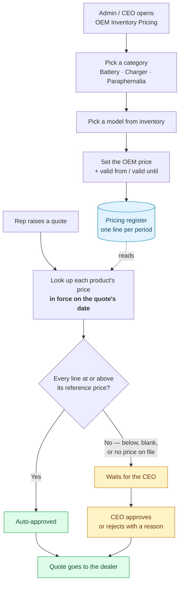
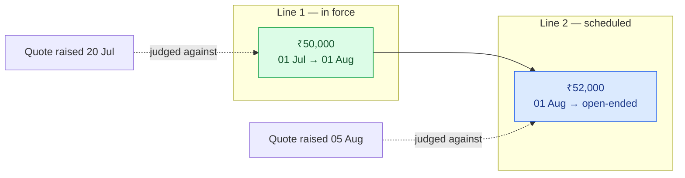
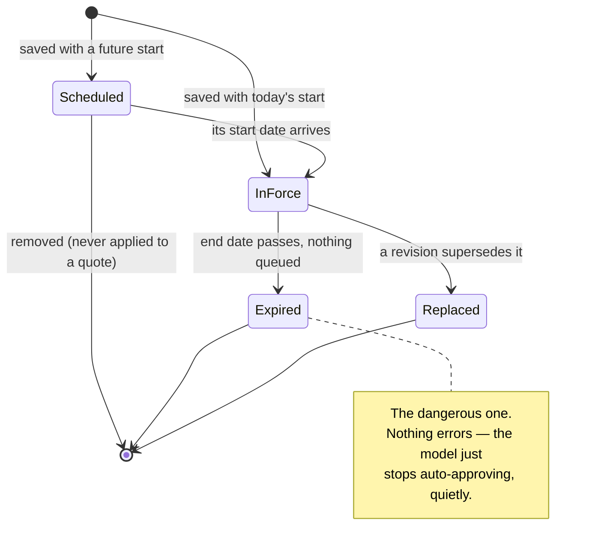
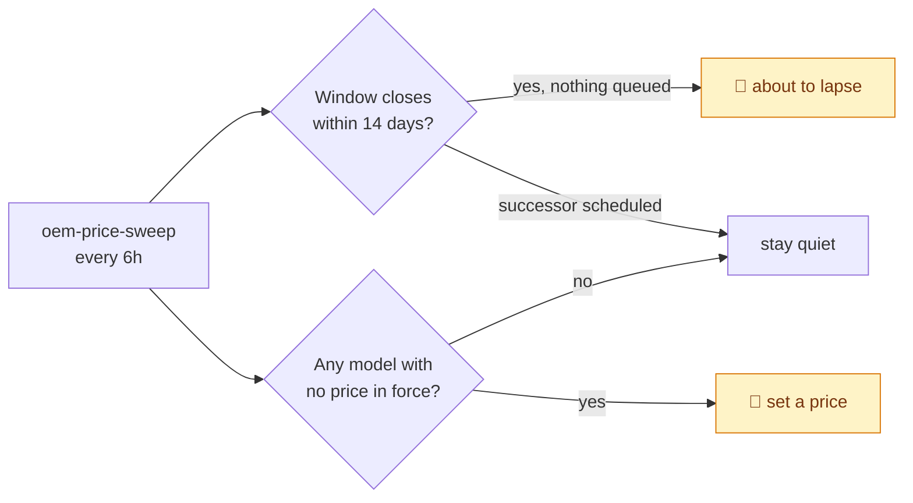

# OEM Inventory Pricing — how the flow works

The register that decides which dealer quotations release themselves and which
come to the CEO.

- **Screen:** `/oem-pricing` (sidebar → BUSINESS → OEM Inventory Pricing)
- **Who:** CEO and Admin
- **Migration:** `E-230_oem_price_validity.sql`
- **Approval rule it feeds:** [quotation-approval-flow.md](./quotation-approval-flow.md)

---

## 1. The whole flow, end to end



**The one thing to understand:** the price here is *what we would pay the OEM to
reorder today* — not what the stock in the warehouse cost us. Those two numbers
part company the moment the OEM revises its list, and quoting off the old landed
cost is the exact mistake this register exists to prevent.

**Where the CEO watches both halves.** `/ceo` → **Quotation Approvals** has two
tabs. *Pending* is the work queue — quotes that failed a check and are blocking
a rep. *Approved* is the record of what has already gone out, each row marked
**Auto** (the rule released it) or with the name of whoever released it by hand.

That second tab exists because auto-approval created a blind spot: before it,
every quote passed through the CEO's hands, so the pending queue was also the
complete record of what went out. Without it, the quotes that clear the
reference price release themselves and appear on no CEO-facing screen at all.

---

## 2. Changing a price — you add a line, you never edit one

A model has **one active price at a time**. To change it, you add the next line
starting where the current one ends.



Because the lookup resolves **by the quote's own date**, the 52,000 line sitting
in the register through July changes nothing about July's quotes. It takes over
on its own.

The old line is never overwritten, so a quote approved on 20 July still shows
the ₹50,000 it was actually judged against — three revisions later.

### On screen

| Button | What it does |
|---|---|
| **Set price** / **Revise** | Adds a line starting today. Supersedes whatever is in force. |
| **📅 Schedule next** | Adds a line starting when the current window closes. Greyed out until the current price has an end date — there'd be no legal start otherwise. |
| **🕘 History** | The full schedule: replaced, in force, scheduled, expired. |

If a new line would clash with one already scheduled, the save is **refused**
and names the date to work around — rather than silently deleting the schedule
someone set up.

---

## 3. A price line's life



**Expired is the state worth watching.** No error, no red screen — the model
simply stops matching the lookup and every quote containing it starts going to
the CEO. The first thing anyone notices is the approval queue filling up. That
is what the notifications below exist to prevent.

A price with **no end date** never expires. It stays the reference until
something replaces it — and nothing will ever prompt you to review it.

---

## 4. What triggers a notification

Both go to **Admin and CEO**, and both land in the bell under **Inventory**.

| Notification | Fires when | Rate limit |
|---|---|---|
| **OEM prices about to lapse** | A price's window closes within 14 days **and nothing is scheduled behind it** | Once per price line |
| **Models with no OEM reference price** | Any active model has no price in force | Once a week |

A price with a successor already queued is deliberately **not** flagged — the
work is done, and nagging about it is how people learn to ignore the bell.

Driven by an in-process ticker (`oem-price-sweep`), every 6 hours. Vercel crons
don't fire on the PM2 boxes, so this is the only driver.



---

## 5. Day one

The register ships **empty**, on purpose. With no prices set:

- every quotation goes to the CEO — **exactly as it does today**
- auto-approval switches on **model by model** as prices are entered
- there is no cutover moment and no flag to flip

Right now on sandbox: **11 active models, 0 priced.** The amber banner on the
screen counts them, and the *Needs a price* filter isolates them.

---

## 6. How to test it

Three layers, cheapest first. The first two need no clicking; the third is the
only one that proves the screen itself.

### a. The approval rule — no database, half a second

```bash
npx vitest run src/lib/leads
```

14 cases over the pure rule: at-or-above passes, one rupee below escalates, one
bad line escalates the whole quote, a blank price escalates, an unknown product
escalates, and the shortfall is counted in rupees on the deal rather than per
unit.

### b. The dated register — live, self-cleaning

```bash
npm run test:oem-pricing
```

This is the one worth running, because the three things most likely to be wrong
are all invisible from a screen you are looking at today:

- a price scheduled for next month must leave today's quotes alone
- a price that ran out must **stop** approving, rather than going on forever
- a new line must never silently delete a successor somebody scheduled

You cannot see any of that by clicking — you would have to wait a month. The
script drives the real `oemPrices.ts` against the real database with explicit
timestamps, so a month passes in a millisecond. It borrows one unpriced model,
walks the ₹50,000 → ₹52,000 example from §2, and on the way out deletes the
lines it inserted and restores anything it touched — including on failure.

It does **not** send notifications. `--sweep` runs the real sweep, which emails
every active CEO/admin and stamps a one-week cooldown; re-arm with
`DELETE FROM app_settings WHERE key = 'oem_price_missing_notified_at';`

### c. The CRM — one scenario, end to end

**"The August price rise on the 105Ah."** One battery, one dealer, one price
change. About ten minutes, and it exercises every claim in this document.

> **Where to run it.** `http://localhost:3000` — `npm run dev`.
> The code is on branch `Aditya` and has not been merged, so
> **sandbox.itarang.com does not have `/oem-pricing` yet**. Localhost points at
> `database-1`, which is sandbox's own database and already has E-230 applied,
> so the data below is real.

**The cast**

| | |
|---|---|
| CEO | `ceo.itarang@gmail.com` / `password` |
| Inside sales rep | `nidhi.itarang@gmail.com` / `password` |
| Product | **51.2V 105AH LFP** (`BAT-51V-105AH-3W`) |
| Lead | **GOLDEN BATTERY SERVICE** — owned by the rep, `Assigned_Not_Contacted` |

The register starts empty, so nothing below is disturbing existing data.

---

**Act 1 — the price does not exist yet, so everything escalates**

1. Log in as the **rep** → *Inside Sales* → open **GOLDEN BATTERY SERVICE** →
   **Update Commercials**.
2. Event type *Quote issued*, Asset type *Battery*, pick **51.2V 105AH LFP**,
   qty 1, unit price **₹60,000**. **Save new version.**

> ✅ Toast reads **"Commercials v1 saved — awaiting CEO approval."**
> Even at ₹60,000. There is no reference price, and the rule fails closed —
> this is today's behaviour for all 11 models, and it is the correct day-one
> state.

**Act 2 — price it, and the same quote releases itself**

3. Log in as the **CEO** → sidebar **BUSINESS → OEM Inventory Pricing**.

> ✅ 11 models, an amber *needs a price* banner, category tabs across the top.

4. On **51.2V 105AH LFP** click **Set price** → **₹50,000**, leave both dates
   blank → save.

> ✅ The row shows ₹50,000, *Valid Until* is blank (open-ended), *Set by* is
> your name, and **📅 Schedule next** is greyed out — with no end date there is
> no legal start for a successor.

5. Back as the **rep**, quote the same battery again at **₹60,000**.

> ✅ **"Commercials v2 saved — quote auto-approved and sent."**
> Same number as step 2. The only thing that changed is that the product now
> has a reference price it clears.

6. Quote once more at **₹48,000**.

> ✅ **"awaiting CEO approval"** — ₹2,000 below reference.

7. As the **CEO**, open `/ceo` → **Quotation Approvals**, tab **Pending**.

> ✅ The ₹48,000 quote is there with its shortfall. The ₹60,000 one is not —
> it went straight to the dealer.

8. Switch to the **Approved** tab.

> ✅ The ₹60,000 quote, with a green **Auto** pill and
> *"1 line at or above OEM reference · ₹10,000 above"*. Expand it for the
> per-line table. The strip above reads *"N quotes released · … · 1
> auto-approved, N-1 by hand"*.
>
> Approve the ₹48,000 one from the Pending tab and it moves across, this time
> with a blue **CEO Test** pill — the panel distinguishes what the rule
> released from what a person did.

**Act 3 — the price rise, and why you add a line instead of editing one**

9. On `/oem-pricing`, **Revise** the 105Ah: ₹50,000, valid until **10 days from
   today**.

> ✅ *Valid Until* fills in and **📅 Schedule next** becomes clickable.

10. **📅 Schedule next** → **₹55,000**, starting the day the current one ends.

> ✅ *Next Scheduled* shows ₹55,000. The live price is **still ₹50,000** —
> queueing it changed nothing about today.

11. Try **Set price** again: ₹47,000 valid until 20 days out.

> ✅ **Refused**, with the date named:
> *"A price is already scheduled to start on … End this one on or before that
> date, or remove the scheduled line first."*
> It did not silently delete the schedule you just set up. This is the failure
> that would otherwise surface weeks later as a quote judged against a price
> you thought you had replaced.

12. Open **🕘 History**.

> ✅ Three lines with state pills: the original ₹50,000 **replaced**, the dated
> ₹50,000 **in force**, the ₹55,000 **scheduled**. The delete button appears
> only on the scheduled one — the other two have judged real quotes.

13. Delete the scheduled ₹55,000 line, then try to delete the one in force.

> ✅ First works. Second refuses: *"already in force — quotes have been judged
> against it. Revise it instead."*

**Act 4 — the notification**

14. The 105Ah now lapses in 10 days with nothing behind it. Restart the dev
    server and wait ~2 minutes (the sweep ticker kicks off 120s after boot).

> ✅ Bell → **Inventory** → *"OEM prices about to lapse"*, linking to
> `/oem-pricing`. Note this **also sends email** to every active CEO/admin.
> Faster: `OEM_PRICE_SWEEP_INTERVAL_MS=60000` in `.env.local`.

---

**Reset when you're done**

```sql
DELETE FROM oem_reference_prices;
DELETE FROM app_settings WHERE key = 'oem_price_missing_notified_at';
DELETE FROM notifications WHERE type LIKE 'oem.%';
```

The quote versions on the lead are ordinary commercials history and can be left
alone. The register is meant to be empty on day one.

---

## 7. Where the code lives

| Piece | File |
|---|---|
| Screen | `src/app/(dashboard)/oem-pricing/page.tsx` |
| Register UI | `src/components/dashboard/oem/OemInventoryPricing.tsx` |
| Schedule drawer | `src/components/dashboard/oem/OemPriceScheduleDrawer.tsx` |
| API | `src/app/api/dashboard/ceo/oem-prices/route.ts` |
| Read / write rules | `src/lib/leads/oemPrices.ts` |
| Approval rule | `src/lib/leads/oemPricing.ts` |
| CEO panel (Pending + Approved) | `src/components/dashboard/ceo/PendingQuotationsPanel.tsx` |
| Panel API | `src/app/api/dashboard/ceo/quotations/route.ts` |
| Notification sweep | `src/lib/leads/oemPriceSweep.ts` |
| Migration | `drizzle/E-230_oem_price_validity.sql` |
| Unit tests (pure rule) | `src/lib/leads/__tests__/oemPricing.test.ts` |
| Live flow check | `scripts/test-oem-pricing-flow.ts` |
