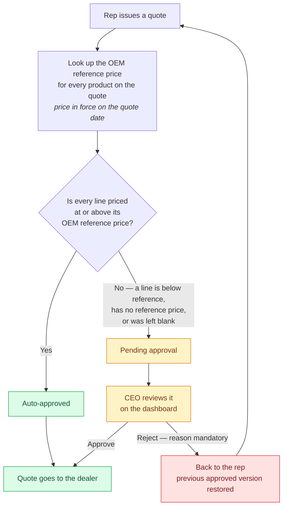

# Quotation Approval Flow

What Kartik specified on the 2026-08-06 call, separated from what was inferred.
Scope is the **approval decision only** — not lead consolidation, not NeoDove,
not the Tarru architecture, all of which were discussed on the same call.

---

## 1. The one thing Kartik actually corrected

Aditya described the flow as: rep raises a quote → look up the **OEM reference
price** → compare. Kartik did not argue with the shape. He stopped the call on
**where that reference price comes from**, and this is the load-bearing
correction of the whole discussion.

> **Aditya (03:03)** — "it'll be stored where the OEM stuff is, where Ruhi adds
> inventory."
>
> **Kartik (03:12)** — "No. One minute. This has nothing to do with inventory.
> Your inventory might have been 2,000 cheaper last month… that's already
> purchased, it makes no difference."
>
> **Kartik (03:40)** — "This is for **future orders** — what my next order is
> going to be from the OEM. Last month he was selling the battery at 50,000;
> this month he raised it to 52,000."
>
> **Aditya (03:50)** — "But our purchase was at 50,000."
>
> **Kartik (03:58)** — "Right, your inventory data may show you bought every
> battery at 50,000 last month. From this month, August, he changed his price.
> He'll sell at 52,000."

**The reference price is the OEM's current forward selling price — the price we
would pay to reorder today. It is explicitly NOT the landed cost of the stock we
are holding.** Those two numbers diverge the moment an OEM changes its price
list, and quoting off the old landed cost is precisely the failure mode Kartik
was describing: we would keep auto-approving quotes against a 50,000 basis while
replacement stock costs 52,000.

This is why the price book is its own register maintained by hand, and not a
column derived from purchase orders or inventory valuation.

---

## 2. The approval rule

Stated by Aditya at 11:57 and **not contradicted** by Kartik, who moved straight
on to asking about the steps *before* step 1. Treat it as accepted:

1. The representative raises the quote and fills in the commercials.
2. The system looks up the OEM reference price **for every product line on the
   quote**.
3. **If every line is priced at or above its reference price → auto-approved.**
   No human touches it.
4. **Otherwise → a pending request goes to the CEO**, who reviews it on the
   dashboard.
5. On reject the CEO **must enter a reason**, and the quote goes **back to the
   representative**.
6. Once approved — automatically or by the CEO — **the quote goes to the
   dealer**.

Two properties follow from Kartik's framing and are worth stating explicitly,
because both are decisions rather than details:

- **The quote is approved or rejected as one document.** A single discounted
  line sends the whole quote to the CEO. Netting a healthy line against a
  loss-making one would silently resolve exactly the judgement call being
  escalated.
- **Absence of a reference price is not consent.** Kartik's instruction at 11:13
  — "if there's no pricing, a notification should go saying set the pricing" —
  only makes sense if an unpriced product is a *blocker*. A line whose product
  has no price on file, or which the rep left blank, has not been margin-checked
  by anybody, so it goes to the CEO. Fail closed.

### The gate, drawn

---

## 3. What the rule reads: the pricing register

Kartik spent 07:07–11:39 specifying the register the lookup hits, because
without it the rule above has nothing to compare against. His words, in order:

| # | Requirement | Source |
|---|---|---|
| 1 | A pricing module lives on the **OEM screen**. "OEM Onboarding" comes off that slot for now and **"OEM Inventory Pricing" replaces it**. | 07:49, 08:23 |
| 2 | Pick from the product catalogue's three categories — **battery, charger, paraphernalia** — then pick a **model ID** from the models we hold in inventory. | 08:23, 11:13 |
| 3 | Set **one price** against that model. | 08:23 |
| 4 | That price carries a **validity period** — a from-date and a to-date. "This 50,000 for this model ID's battery is valid until August 1st." | 08:23, 09:39 |
| 5 | **One model ID cannot have multiple active prices. Exactly one price is active at a time.** | 09:39 |
| 6 | To change or extend, you **add a second line** for the same model ID, starting **after** the first line's validity ends — "my next pricing for the next period would be 52,000." | 09:39 |
| 7 | Before a validity window expires, a **notification goes to Admin and CEO**: update the pricing register. | 09:23, 10:28 |
| 8 | If a model has **no price at all**, a notification goes out to set one. | 11:13 |
| 9 | **The lookup resolves against the validity dates** — "your lookup happens according to the validity set on that pricing engine." | 11:39 |

Item 9 is the join between this section and section 2, and it is stricter than it
looks: the quote is judged against the price **in force on the quote's own
date**, not against "the latest row". That is what makes a scheduled 52,000 line
starting 1 August leave July's quotes alone.

---

## 4. The structural constraint

Kartik's complaint at 10:28, restated at 11:08:

> "The structure that's been built is very broken. Things are happening here and
> there, nothing is in a flow. If I want to skip step 1 and work on step 5, that's
> possible — there's that possibility. That should not happen."

Applied to approval, this means the flow is a **strict sequential state
machine**, not a set of independently reachable screens. A quote cannot be sent
to a dealer without having passed the gate; the gate cannot be reached without
commercials; a rejected version cannot quietly become current again. Any path
that lets a stage be skipped is a defect regardless of whether the individual
screens work.

---

## 5. Where the transcript is silent

Flagging these rather than inventing answers — each would change behaviour if
guessed wrong:

- **Who besides the CEO can approve.** Only the CEO is ever named. Admin is named
  as a *notification* recipient for pricing expiry (09:23), never as an approver.
- **Any threshold or tolerance.** The rule as stated is a hard comparison at the
  reference price. No "within 2% auto-approves" was discussed.
- **Whether a rejected quote is a distinct state or just a prompt to re-quote.**
  "It goes back to the representative" (12:02) is compatible with both.
- **Escalation if the CEO does not act.** Kartik asked "what should the
  escalation be?" at 48:41; the answer given covered the ASM transfer for site
  negotiation, not an approval-ageing escalation. Still open.
- **GST/discount/freight**, and whether the comparison is on unit price before or
  after them. Only unit price was discussed.

---

## 6. Built vs. outstanding

| Requirement | State |
|---|---|
| Per-line comparison, all-lines-clear → auto-approve | Built — `src/lib/leads/oemPricing.ts` (E-226) |
| Below reference / no reference / blank → CEO | Built, fail-closed |
| CEO queue, approve/reject, **mandatory** reason | Built — `api/dashboard/ceo/quotations/[commercialId]/decision` (E-221) |
| Audit snapshot of what the quote was judged against | Built — `dealer_lead_commercials.oem_evaluation` |
| Price register with history | Built — `oem_reference_prices` (E-226) |
| **Admin-set validity window (from/to) on a price** | **Added — E-230** |
| **Scheduled successor line for the same model** | **Added — E-230** |
| **Lookup resolved by validity date rather than "latest row"** | **Added — E-230** |
| **Expiry notification to Admin + CEO** | **Added — E-230** |
| **Missing-price notification** | **Added — E-230** |
| "OEM Inventory Pricing" on the OEM tab | **Added — `/oem-pricing`** |
| Approval-ageing escalation | Not built — not specified |
